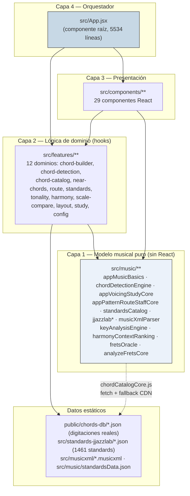
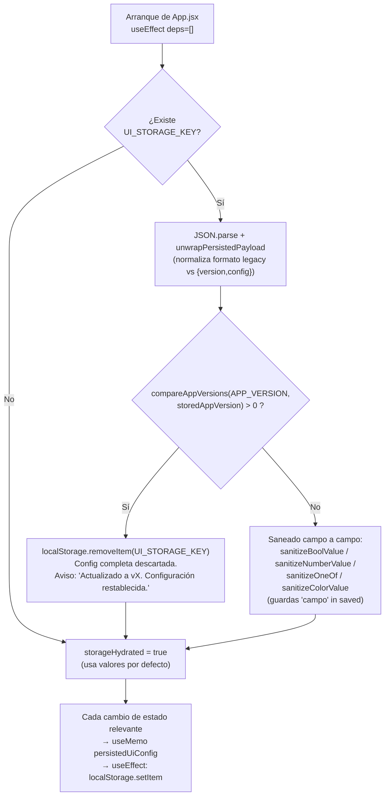
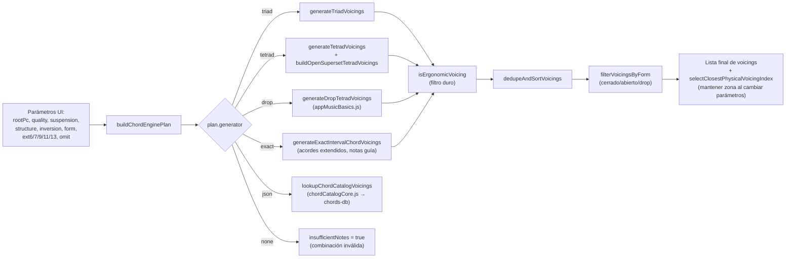
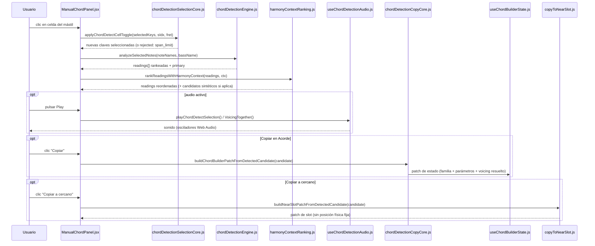

# Documento de Diseño Técnico del Software (DTS) — Mástil Escalas

> Repositorio: `a01653/mastil_escalas` · Paquete npm: `escalas` · Versión analizada: **6.0.94** (`package.json:4`, `src/App.jsx:303`)
> Fecha de análisis: 2026-08-17. Documento generado por auditoría directa del código fuente local, basado principalmente en revisión directa del código: lectura de configuración, estructura completa de `src/`, ejecución real de `npm test` y `npm run build`.

---

## 1. Objetivo y alcance

**Mástil Escalas** es una aplicación web de página única (SPA), en español, para el estudio interactivo del mástil de guitarra: escalas, patrones de digitación (CAGED, 3NPS, cajas de pentatónica), rutas melódicas, construcción y análisis de acordes (voicings), comparación de acordes cercanos con conducción práctica, y consulta de standards de jazz con sus cifrados armónicos (`README.md:1-9`).

El objetivo declarado por el propio proyecto (`README.md:78-87`) es servir de herramienta de apoyo al estudio de guitarra para: localizar notas en el mástil, entender intervalos y construcción de escalas, relacionar escalas con acordes, estudiar patrones reales de digitación, analizar inversiones/drops/voicings, y trabajar progresiones y acordes cercanos de forma visual.

**Alcance de este documento**: describe el estado real del código en la rama `main` (remoto `https://github.com/a01653/mastil_escalas.git`), tomando como base el commit `6ec9a1b` **más los cambios locales sin commitear presentes en el árbol de trabajo en el momento del análisis** — concretamente la reordenación de "Comparar" en la navegación y el ajuste del botón "Ayuda", en `src/App.jsx`, `src/components/layout/AppHeader.jsx`, `src/music/appStaticData.js` y `e2e/mobile-navigation.spec.js` —, verificado mediante lectura directa de ficheros y ejecución de la suite de tests y del build de producción. No cubre el histórico de decisiones de diseño no documentado en el código, ni funcionalidades planificadas que no tengan código ya implementado.

---

## 2. Arquitectura general

La aplicación es un **SPA cliente puro** sin backend propio: todo el cálculo musical (teoría, detección de acordes, generación de voicings, análisis de rutas) ocurre en el navegador, en JavaScript. No hay servidor de aplicación, API REST propia, ni base de datos; la persistencia es exclusivamente `localStorage`/`sessionStorage` del navegador (§6), y los datos "servidos" son ficheros estáticos (JSON de digitaciones, JSON/MusicXML de standards) desplegados junto al bundle.

### 2.1 Capas de código

El código fuente (`src/`) se organiza en **cuatro capas** con dependencias en una sola dirección (sin ciclos entre capas, aunque sí un caso de importación circular deliberada dentro de la capa de modelo, ver §7):



- **`src/music/`** (capa 1): funciones puras de teoría musical y análisis, sin dependencias de React ni del DOM (con la única excepción de `appPatternRouteStaffCore.jsx`, que además exporta un componente React `MusicStaff`). Es el núcleo testeable de forma aislada y reutilizado por scripts de auditoría (`scripts/*.mjs`) fuera del navegador.
- **`src/features/`** (capa 2): un hook `use<Dominio>Feature.js` por dominio funcional, que envuelve el modelo puro con `useState`/`useEffect`/`useMemo` de React y expone datos "listos para pintar" más acciones. Varios dominios separan explícitamente un fichero `*Core.js` puro (testeado con su `.test.js` homónimo) del hook con estado.
- **`src/components/`** (capa 3): componentes de presentación agrupados por dominio (`chords/`, `near-chords/`, `standards/`, `route/`, `study/`, `tonal/`, `config/`, `fretboard/`, `ui/`, `help/`, `layout/`). La mayoría no mantiene estado de negocio propio; reciben datos ya calculados por props agrupadas.
- **`src/App.jsx`** (capa 4): componente raíz único (`FretboardScalesPage`, `src/App.jsx:310`) que instancia los 7 hooks de dominio, mantiene el estado que no encaja en ningún hook de `features/` (persistencia, tema, presets, navegación), y ensambla el árbol de componentes final.

No existe una carpeta `src/hooks/` ni `src/services/` convencional: los hooks reutilizables viven dentro de `src/features/*/use*.js` (12 hooks de dominio) y dos hooks pequeños en `src/components/chords/` (`useChordPanelModel.js`, `useNearCopyFeedback.js`); el rol de "capa de servicios" lo cumple `src/features/chord-catalog/chordCatalogCore.js`, que es el único punto del código que hace `fetch()` a recursos externos al bundle.

### 2.2 Patrón arquitectónico observado

El patrón dominante es **"God component" orquestador + hooks de dominio + componentes tontos**: `App.jsx` concentra 52 `useState`, 26 `useEffect`, 44 `useMemo` y 6 `useCallback` propios (recuento directo por grep sobre el fichero), además de desestructurar agresivamente el estado devuelto por los 7 hooks de `features/` (p. ej. el hook del constructor de acordes se desestructura en 56 identificadores locales, `src/App.jsx:403-460`). El resultado se reparte a los paneles hijos como **objetos de props agrupados por dominio** (p. ej. `<ChordsPanel layout={...} chordCtrl={...} quartalCtrl={...} guideToneCtrl={...} uiCls={...} voicingData={...} detectArea={...} renderFns={...}>`, `src/App.jsx:5141-5207`).

Dentro de cada dominio de `features/` se repite un segundo patrón, más limpio: **núcleo puro + hook con estado**. Ejemplos verificados: `chordDetectionSelectionCore.js`/`useChordDetectionFeature.js`, `chordCatalogCore.js` (puro, sin hook propio — el estado de caché lo gestiona `App.jsx`), `copyToNearSlot.js`/`NearChordsPanel.jsx`, `scaleResolutionUtils.js`/`scaleCompareUtils.js`. Cada núcleo puro tiene un test unitario homónimo.

---

## 3. Tecnologías y dependencias

Extraído de `package.json` (verificado, no inferido):

| Categoría | Tecnología | Versión |
|---|---|---|
| Framework UI | React + react-dom | `^19.2.0` |
| Build tool | Vite | `^7.3.1` |
| Plugin React (Babel) | `@vitejs/plugin-react` | `^5.1.1` |
| CSS | Tailwind CSS (plugin Vite, **sin** `tailwind.config.js` — configuración CSS-first vía `@import "tailwindcss";` en `src/index.css:1`) | `^4.2.1` (`@tailwindcss/vite`) |
| Iconos | `lucide-react` | `^0.577.0` |
| Empaquetado móvil | Capacitor (`@capacitor/core`, `/android`, `/cli`) | `^8.4.1` |
| Testing unitario | Vitest + jsdom | `^4.1.5` / `^29.1.1` |
| Testing E2E | Playwright | `^1.60.0` |
| Linter | ESLint 9 (flat config) + `eslint-plugin-react-hooks` + `eslint-plugin-react-refresh` | `^9.39.1` |
| Otras devDependencies | `postcss`, `autoprefixer`, `puppeteer-core` (usado en `scripts/visualReview*.mjs`) | — |

No hay gestor de estado global externo (Redux, Zustand, Context API de React tampoco se usa para estado compartido — todo el estado cruza por props desde `App.jsx`), ni router (aplicación de una sola vista con navegación por pestañas controlada por estado local), ni ORM/backend.

**Target de build**: `es2018` (`vite.config.js:22`). **Base pública**: `/mastil_escalas/` para el despliegue web (`vite.config.js:9`, GitHub Pages) y `./` para el empaquetado Android (`vite.config.android.js:9`, WebView de Capacitor sirviendo ficheros locales).

---

## 4. Estructura del proyecto

```
mastil_escalas/
├── src/
│   ├── App.jsx                  # Componente raíz (5534 líneas), único punto de entrada visual
│   ├── main.jsx                 # Bootstrap de React + error boundary + pantalla de carga
│   ├── App.css / index.css      # Estilos globales; index.css solo importa Tailwind v4
│   ├── App.smoke.test.jsx       # Test de humo del montaje de App
│   ├── components/              # 29 componentes de presentación, agrupados por dominio
│   │   ├── layout/  fretboard/  ui/  help/  standards/  route/  study/
│   │   ├── chords/  tonal/  config/  near-chords/  PanelBlock.jsx
│   ├── features/                # 12 dominios de lógica (hooks + núcleos puros)
│   │   ├── chord-builder/  chord-detection/  chord-catalog/  near-chords/
│   │   ├── route/  standards/  tonality/  harmony/  scale-compare/
│   │   ├── layout/  study/  config/
│   ├── music/                   # Modelo musical puro (17 módulos + tests)
│   ├── utils/configIo.js        # Serialización de export/import de configuración
│   ├── standards-jjazzlab/      # 1461 ficheros JSON de standards (fuente JJazzLab)
│   └── musicxml/                # Cientos de ficheros .musicxml (fuente alternativa)
├── public/chords-db/            # Base de datos física de digitaciones reales (JSON por nota)
├── scripts/                     # Auditorías, generadores y CLIs de análisis (Node, .mjs)
├── e2e/                         # 33 specs de Playwright
├── android/, capacitor.config.json, vite.config.android.js   # Empaquetado Android
├── docs/frets-oracle.md         # Documentación de la batería de validación del lector de voicings
├── .github/workflows/deploy-pages.yml   # CI/CD a GitHub Pages
├── vite.config.js, eslint.config.js, playwright.config.js
└── package.json
```

No existe `README` de arquitectura previo a este DTS más allá del `README.md` de producto (orientado a usuario final) y `docs/frets-oracle.md` (documentación específica de la batería de validación del motor de lectura de voicings).

---

## 5. Componentes principales y responsabilidades

### 5.1 Layout y navegación

| Componente | Responsabilidad |
|---|---|
| `components/layout/AppHeader.jsx` | Cabecera: título, badge de versión, menú hamburguesa móvil, barra de navegación de escritorio (un `ToggleButton` por sección), botón de ayuda (abre `ManualOverlay`), y el `<input type="file">` oculto real para importar configuración (ver §12). |
| `components/layout/AppFooter.jsx` | Pie estático con crédito de autoría. |
| `components/help/ManualOverlay.jsx` | Modal de manual de uso, contenido 100% estático en español. |
| `components/help/MobileInfoPopover.jsx` | Popover de ayuda contextual táctil, posicionado dinámicamente junto al icono ⓘ de origen. |
| `components/PanelBlock.jsx` | Contenedor "átomo de layout" (sección/subsección con cabecera coloreada y cuerpo colapsable) reutilizado por prácticamente todos los paneles. |

### 5.2 Mástil y primitivas visuales

| Componente | Responsabilidad |
|---|---|
| `components/fretboard/FretboardShared.jsx` | Piezas de mástil de escritorio: nota al pasar el ratón, fila de incrustaciones, cabecera numérica de traste. |
| `components/fretboard/MobileMainFretboard.jsx` | Mástil vertical genérico para layout móvil; el contenido de cada celda se delega en un callback `renderCell`, reutilizado por acordes, ruta y acordes cercanos. |
| `components/fretboard/ChordVoicingFretboards.jsx` | `ChordFretboard`/`GuideToneFretboard`: mástiles especializados en pintar un *voicing* coloreando por rol armónico o por rol de notas guía. |
| `components/fretboard/FretNoteMarker.jsx` | Marcador circular de nota genérico, base de los clústeres superpuestos de Acordes cercanos. |
| `components/ui/AppUiPrimitives.jsx` | `ToggleButton`, `InfoTitle` — primitivas compartidas. |
| `components/ui/ColorPickerPopover.jsx` + `colorUtils.js` | Selector de color propio (HSV, sin `<input type=color]` nativo), con flujo de borrador (Aceptar/Cancelar). |

### 5.3 Acordes

| Componente | Responsabilidad |
|---|---|
| `components/chords/ChordsPanel.jsx` (933 líneas) | Panel "Acorde": constructor tonal/cuartal/notas guía, controles de calidad/estructura/forma/inversión/extensiones/omisión, navegador de voicings, mástiles de acorde. |
| `components/chords/ManualChordPanel.jsx` (841 líneas) | Modo Manual ("Investigar en mástil"): selección de notas en el mástil, lecturas detectadas agrupadas en principales/avanzadas, lecturas extra del oráculo bajo demanda, reproducción de audio, "Copiar a cercano". |
| `components/chords/useChordPanelModel.js` | Hook de lógica de pantalla del constructor (handlers de tono, suspensión, extensiones, forma). |
| `components/chords/useNearCopyFeedback.js` | Feedback visual temporal (1.5 s) tras copiar una lectura a un slot cercano. |

### 5.4 Acordes cercanos y análisis de tonalidad

| Componente | Responsabilidad |
|---|---|
| `components/near-chords/NearChordsPanel.jsx` (637 líneas) | Orquestador: selector de estilo/progresión, toggle "Auto escala", los 4 `NearChordSlot`, y el mástil compartido con clústeres de hasta 4 notas superpuestas por celda. |
| `components/near-chords/NearChordSlot.jsx` (793 líneas) | Editor de un slot: bifurca la UI según familia (terciana/cuartal/notas guía), navegador de voicings, distancia máxima, cuerdas al aire. |
| `components/near-chords/KeyProgressionAnalyzer.jsx` (686 líneas) | Acordeón de análisis de tonalidad sobre una progresión pegada por el usuario: tonalidades detectadas, centros modales compatibles. |

### 5.5 Contexto tonal, estudio y standards

| Componente | Responsabilidad |
|---|---|
| `components/tonal/TonalContextPanel.jsx` | Raíz, notación, escala, armonización, notas extra, cajas de blues. |
| `components/study/StudyPanel.jsx` (974 líneas) | "Modo estudio": identidad y acorde relativo, reglas de construcción, compatibilidad armónica, función en números romanos, guía de sustituciones (5 pestañas), exportación a PDF. |
| `components/standards/StandardsPanel.jsx` + 6 subcomponentes | Catálogo filtrable, ficha de metadatos, "forma" del tema con cifrado por compás y selección de hasta 4 eventos para enviar a Acordes cercanos. |
| `components/route/RouteLabFretboard.jsx` | Mástil del laboratorio de rutas: escala activa + ruta calculada superpuesta, modo debug con traza paso a paso. |
| `components/config/AppConfigPanel.jsx` | Panel "Configuración" (ver §12). |

---

## 6. Gestión del estado y persistencia

### 6.1 Modelo de estado

No hay `useReducer` ni store externo: **todo el estado es `useState` distribuido**, agrupado en 7 hooks de dominio (`useTonalityFeature`, `useMobileLayoutFeature`, `useChordBuilderState`, `useChordDetectionFeature`, `useRouteFeature`, `useHarmonyFeature`, `useStandardsFeature`) más el estado propio de `App.jsx` para lo que no encaja en ningún dominio (persistencia, tema, presets, colores, comparador de escalas, King Boxes de blues).

### 6.2 Persistencia en navegador

Tres claves de almacenamiento, definidas en `src/App.jsx:298-303`:

| Clave | Storage | Contenido |
|---|---|---|
| `mastil_interactivo_guitarra_config_v1` | `localStorage` | Payload completo de configuración (~90 campos): escala, notación, King Boxes, acorde principal completo (terciano+cuartal+notas guía), detección de acordes, acorde de referencia, 4 slots de acordes cercanos, key-analyzer, ruta/route-lab, colores y tema. |
| `mastil_interactivo_guitarra_presets_v1` | `localStorage` | Hasta `QUICK_PRESET_COUNT = 3` presets rápidos, cada uno `{name, savedAt, payload}` con el mismo formato que la config principal. |
| `mastil_interactivo_guitarra_status_v1` | `sessionStorage` | Aviso de un solo uso que sobrevive a un `reload()` forzado (tras importar, restablecer o cargar un preset), leído y borrado al arrancar. |



Puntos verificados relevantes:

- **Migración por versión de app es "todo o nada"**: si `APP_VERSION` (`6.0.94`) es mayor que la versión que generó la config guardada, la config **se borra íntegramente** (`src/App.jsx:1108-1112`) — no hay migración incremental campo a campo entre versiones de la app. La migración incremental sí existe, pero para el campo `version` interno del payload (`UI_CONFIG_VERSION = 1`, distinto de `APP_VERSION`): si difiere, solo se muestra un aviso informativo y se aplica saneado defensivo campo a campo sin descartar nada (`src/App.jsx:1116-1298`).
- **Saneado sistemático**: todas las lecturas usan una vocabulario común de validadores puros de `src/music/appPatternRouteStaffCore.jsx` (`sanitizeBoolValue`, `sanitizeNumberValue`, `sanitizeOneOf`, `sanitizeColorValue`, `sanitizeNearSlotValue`, `sanitizePresetCollection`), de forma que una config corrupta o de formato antiguo nunca rompe el arranque; en el peor caso cae a valores por defecto campo a campo.
- **Campo no persistido detectado**: `chordDetectClickAudio` (mute del sonido al pulsar celdas en el modo Manual) no aparece en la lista de ~90 campos de `persistedUiConfig` (`src/App.jsx:850-953`) — el estado de mute del audio de detección **no sobrevive a un recargado de página** (ver también §11 y §17).

---

## 7. Modelo musical: notas, intervalos, escalas, patrones y acordes

### 7.1 Representación de alturas

Las clases de altura (*pitch classes*) son enteros `0..11` con `C = 0`. `mod12(n)` (`src/music/appMusicBasics.js:25`) normaliza cualquier entero. La enarmonía se controla mediante un flag `preferSharps: boolean` que acompaña al pitch class en casi toda la API: `pcToName(pc, preferSharps)`, `pcToDualName(pc)` (devuelve `"C#/Db"` salvo notas naturales), `chordUiLetterFromPc(pc, preferSharps)` (letra base para el selector de tono).

`pitchAt(sIdx, fret)` (`appMusicBasics.js:58`) traduce cuerda+traste a altura MIDI absoluta sumando el traste al MIDI de cuerda al aire (`OPEN_MIDI`, `appStaticData.js:276`, afinación estándar E2-A2-D3-G3-B3-E4). `noteNameToPc(token)` hace el camino inverso, admitiendo dobles alteraciones (`F##`, `Gbb`).

El deletreo letra-a-letra real (para mostrar `C#` vs `Db` correctamente según el contexto) se calcula con `spellNoteFromChordInterval`/`spellChordNotes`/`spellPcWithLetter` (`appMusicBasics.js:817-1660`). **Nota de diseño verificada**: estas mismas funciones de deletreo están *duplicadas* de forma independiente en `chordDetectionEngine.js:76-106`, porque ese módulo tiene la restricción arquitectónica de no importar de ningún otro módulo de `src/music/` (es la capa 0 explícita del sistema).

### 7.2 Escalas

`SCALE_PRESETS` (`appStaticData.js:107`) es un diccionario de ~30 escalas → array de intervalos: pentatónicas mayor/menor, mayor/menor natural, los 7 modos griegos, menor armónica/melódica, mayor armónica, doble armónica/bizantina, frigia mayor, lidia dominante, alterada, húngara menor gitana, 7 escalas bebop de 8 notas, pentatónicas con *blue note*, hirajoshi, tonos enteros, disminuidas H-W/W-H, y `"Personalizada"` (intervalos libres introducidos por el usuario). La armonización diatónica en tétradas de cada grado se construye con `buildHarmonyDegreeChord` (`appMusicBasics.js:537`), con una excepción explícita para **armonía funcional menor** (fuerza V7 en vez de v cuando `harmonyMode === "functional_minor"`).

Para escalas cuya cifra diatónica estándar (apilar terceras) no produce resultados musicalmente correctos (pentatónicas, bebop, húngara gitana, doble armónica), existe una tabla de armonizaciones curadas a mano: `MANUAL_SCALE_TETRAD_PRESETS`/`MANUAL_SCALE_HARMONY_PRESETS` (`appStaticData.js:175-263`).

### 7.3 Patrones sobre el mástil (`appPatternRouteStaffCore.jsx`)

- **3NPS** (`build3NpsPatternsMerged`/`build3NpsPatternInstances`): para escalas de 7 notas, 3 notas por cuerda, 7 posiciones (una por grado).
- **CAGED** (`buildCagedPatternInstances`/`pickCagedViewPatterns`): 5 formas ancladas en 4ª/5ª/6ª cuerda según la letra (`CAGED_DEFS`), funcional con cualquier escala/modo (no solo mayor), no solo con acordes.
- **Cajas de pentatónica** (`buildPentatonicBoxInstances`): ventanas de 5 trastes con offsets predefinidos distintos para pentatónica mayor (`[0,2,4,7,9]`) y menor (`[0,3,5,7,10]`).
- 2NPS existe en el código (`_build2NpsPatternsMerged`) pero no se usa activamente en la ruta principal actual (mantenido por compatibilidad).

### 7.4 Motor de acordes: nombres, sufijos e intervalos

`chordSuffixFromUI(...)` (`appMusicBasics.js:140`) traduce el estado de la UI (calidad/suspensión/estructura/extensiones) a un sufijo interno; `chordDisplayNameFromUI(...)` (línea 358) compone el nombre final mostrado, con reclasificación de tríada-con-7ª-marcada como cuatriada de facto y notación `(addN,...)` cuando hace falta representar tensiones sin las intermedias. `buildChordIntervals(...)` (línea 1424) calcula el conjunto final de semitonos con un modelo de "slots" para tétradas (7ª ocupa 1 slot, cada *add* ocupa 1 slot más, máximo 1-2 según `omit`).

**Catálogos de UI verificados** (`appMusicBasics.js:1076-1132`): `CHORD_QUALITIES` = `maj, dom, min, minmaj7, dim, hdim`; `CHORD_STRUCTURES` = `triad, tetrad, chord`; `CHORD_FAMILIES` = `tertian, quartal, guide_tones`; `CHORD_INVERSIONS` = `root, 1, 2, 3, all`; `CHORD_FORMS` = `closed, open` + 6 formas drop (`drop2_set1/2/3`, `drop3_set1/2`, `drop24_set1/2`).

### 7.5 Estructuras cuartales y notas guía

Las estructuras cuartales (`fnBuildQuartalPitchSets`, `appMusicBasics.js:1219`) se construyen apilando cuartas justas desde la raíz (`type="pure"`) o alterando una cuarta a tritono (`type="mixed"`), o bien siguiendo la escala activa en pasos de 3 grados diatónicos (`reference="scale"`), clasificando el resultado como `pure`/`mixed` según si algún paso es de 6 semitonos. Las notas guía (`guideToneDefinitionFromQuality`, línea 1138) modelan *shells* de 3 notas para `min7/dom7/maj6/maj7` (p. ej. `min7 → intervalos [0,3,10]`, etiquetas `1,b3,b7`).

### 7.6 Motor de detección de acordes (`chordDetectionEngine.js`)

Es el módulo de menor nivel del sistema: no importa de ningún otro módulo de `src/music/` (confirmado por lectura completa), y exporta `noteNameToPc`/`preferSharpsFromMajorTonicPc` consumidos por el resto. Punto de entrada: `detectChordReadings(selectedNotes)` (línea 1399), que combina tres generadores de candidatos:

1. **Fórmulas catalogadas** (`collectFormulaCandidates`, línea 1056): recorre `CHORD_DETECT_FORMULAS` (~60 fórmulas, línea 117), exige ≥2 (díada) o ≥3 coincidencias con tolerancia de 1 grado ausente.
2. **Cuartales manuales** (`buildQuartalManualCandidates`, línea 613): cadenas de cuartas (pasos de 5-6 semitonos) entre las notas seleccionadas.
3. **Heurística terciana general** (`buildHeuristicTertianCandidates`, línea 797): deduce calidad por presencia de 3ª/5ª/7ª y compone tensiones (9, 11, 13, #9, b13, #11) para conjuntos de notas sin fórmula catalogada exacta, incluyendo el caso de dominante alterada.

El **ranking** (`candidateProbabilityScore`, línea 497) combina penalización por complejidad de fórmula, por grados omitidos (+9, +5 extra si es la 3ª), por 5ª alterada no estructural (+8), y un modelo explícito de peso para bajo tipo *slash* (-8 si tríada exacta con bajo externo). Tras el ranking, un pipeline adicional filtra candidatos contradictorios, colapsa "gemelos enarmónicos" preservando el deletreo con menos alteraciones, deduplica por contenido semántico, filtra bajos "raros" (`B#/E#/Cb/Fb`) cuando hay alternativa más limpia, recorta a 12 resultados y decora alias especiales (*Hendrix chord*, *Mystic chord*, *James Bond chord*, *So What chord*).

El módulo también implementa **continuidad de selección**: `pickDefaultChordCandidate`/`resolveDetectedCandidateFromContext` mantienen "la misma" lectura seleccionada cuando el usuario modifica ligeramente las notas del mástil (continuidad estructural, de pitch, de movimiento de bajo, de raíz desplazada cromáticamente).

### 7.7 Interpretación por contexto armónico (`harmonyContextRanking.js`)

Reordena (sin modificar) las lecturas del motor anterior en función de un **acorde de referencia** fijado manualmente por el usuario (p. ej. "estoy tocando sobre un D7"). `rankReadingsWithHarmonyContext` puntúa cada lectura por coincidencia de raíz (+2), calidad (+1) y grafía (+0.5); cuando ninguna lectura literal explica bien el contexto, genera **candidatos sintéticos** (dominante con tensiones reinterpretadas, fragmento sin 7ª, *rootless* de `maj7`, fragmento 6/9), siempre marcados `contextual: true` para que la UI los distinga.

### 7.8 Análisis de tonalidad de progresiones (`keyAnalysisEngine.js`)

Módulo independiente (no depende de `chordDetectionEngine.js`) que, a partir de texto libre de acordes, puntúa cada combinación tónica×escala (Mayor/Menor natural) por ajuste diatónico, dominante funcional y dominante secundario, devuelve hasta 6 tonalidades candidatas, calcula centros modales compatibles (6 modos griegos evaluando qué tónica modal encaja mejor) y detecta intercambio modal (acordes prestados de un modo paralelo) con explicaciones textuales del tipo `"Ab → bVI, prestado de C eólico"`.

---

## 8. Construcción y análisis de voicings (`appVoicingStudyCore.js`, 3481 líneas)

### 8.1 Parseo y filtro ergonómico

`parseChordDbFretsString`/`buildVoicingFromFretsLH` convierten el formato de 6 caracteres del dataset de digitaciones (Low E→High E, `x`=muda, base-36 para trastes >9) en un objeto `voicing` completo (notas, bajo real, span, alcance, intervalos relativos). `isErgonomicVoicing(v, maxReachLimit=4)` es el **filtro ergonómico de generación**: descarta digitaciones con alcance >4 trastes o huecos >3 trastes entre dedos consecutivos — actúa como poda dura durante la enumeración, antes de cualquier puntuación.

### 8.2 Orquestador central



`buildChordEnginePlan(...)` (línea 985) es el orquestador: calcula offsets de 3ª/5ª/7ª/voz superior, el conjunto de intervalos y el bajo, y decide `layer` (etiqueta conceptual: `triad/tetrad/add/multi_add/extended/drop/chord/unsupported`) y `generator` (estrategia real de generación: `triad/tetrad/drop/exact/json/none`) según la combinación de estructura, extensiones, `omit` y elegibilidad drop.

### 8.3 Selección y estabilidad física ("mantener zona")

`physicalVoicingDistance(reference, candidate)` calcula una distancia ponderada por cuerda (traste, sonoridad, posición central, traste mín/máx, nº de cuerdas sonantes, bajo). `selectClosestPhysicalVoicingIndex(reference, options, {reasonableDistance})` la usa para mantener estable la digitación mostrada al cambiar un parámetro del acorde (`chordKeepZone` activado), cayendo a un índice por defecto si ninguna opción está dentro del umbral. Cuando `chordKeepZone` está desactivado, se usa en su lugar `selectNaturalGuitarVoicingIndex` (raíz en el bajo, traste mínimo bajo, más cuerdas sonantes, menor span).

### 8.4 Formas y drops

`isDropForm`/`filterVoicingsByForm` clasifican y filtran por posición cerrada/abierta o forma drop. `classifyManualVoicingShape(manualVoicing, detectedChord)` (probado por `classifyVoicingShape.test.js`) identifica si un voicing manual de 4 notas corresponde a una forma drop concreta, probando todas las combinaciones `dropKind × inversión` contra el patrón de alturas esperado.

### 8.5 Filtro "guitarístico" (independiente del ergonómico de generación)

Al final del fichero (bloque `GUITARISTIC VOICING FILTER`, línea 3241) hay un **segundo sistema de puntuación**, distinto de `isErgonomicVoicing`: `_guitaristicComponents` calcula `score = sonantes×2 + al_aire×3 + (cejilla_limpia?4:0) − mudas_internas×4 − max(0,trasteMín−7) − max(0,span−3)×2`. `filterGuitaristicVoicings(level, voicings)` filtra en tres niveles: `all` (sin cambio), `habitual` (formas de catálogo sin mudas internas), `essential` (además `trasteMín ≤ 12`, una forma por posición). `MAX_VOICING_OPTIONS = 1000` actúa como tope de seguridad tras generar/deduplicar/ordenar.

### 8.6 Digitaciones reales (base de datos física)

`src/features/chord-catalog/chordCatalogCore.js` es el puente entre el constructor de acordes y el dataset físico servido en `public/chords-db/<Nota>/<sufijo>.json` (p. ej. `chords-db/G/major_b.json`). `lookupChordCatalogVoicings(...)` valida con `chordCanUseJsonCatalog` si la combinación es "buscable" en JSON, construye la lista de sufijos a probar (genérico primero, sufijo de bajo específico `_b` como *fallback*) y cachea resultados por `"<nota>/<sufijo>"`. **`fetchChordDbJsonWithFallback`** intenta primero la ruta local (`import.meta.env.BASE_URL + chords-db/...`) y, si falla, reintenta contra `CHORD_DB_PAGES_BASE = "https://a01653.github.io/mastil_pruebas/"` — un despliegue estático **externo, en otro repositorio**, usado como *fallback* absoluto (ver riesgo en §17).

---

## 9. Búsqueda de acordes cercanos y voice leading

`components/near-chords/NearChordsPanel.jsx` gestiona hasta **4 slots** de acorde simultáneos (`nearSlots`, `src/App.jsx:640`), cada uno con su propia familia (terciana/cuartal/notas guía) y parámetros independientes.

**Mecanismo de "cercanía" verificado en código** (`src/App.jsx:2278-2647`): existe una **ventana de trastes compartida** `[nearFrom, nearTo]` (por defecto inicio=1, tamaño=6 → trastes 1-6; controlable con flechas ◀/▶ y campo "Tamaño"). Para cada slot activo, se generan sus voicings candidatos con el mismo motor de §8 (`buildChordEnginePlan` + generadores de `appVoicingStudyCore.js`) y se filtran con:

```js
// src/App.jsx:2642-2647
const voicingFits = (v) =>
  isErgonomicVoicing(v, maxSpan) &&
  (v.notes || []).every((n) => n.fret === 0 ? allowOpenStrings : inNearWindow(n.fret));
```

Es decir: **la "cercanía" entre los hasta 4 acordes se logra forzando a todos a caber en la misma ventana estrecha de trastes**, no mediante un optimizador de conducción de voces que minimice el movimiento nota-a-nota entre acordes consecutivos. La "conducción de voces práctica" mencionada en el README se traduce, en el código actual, en: (a) la restricción de ventana compartida, y (b) la reutilización del mecanismo de estabilidad física (`selectClosestPhysicalVoicingIndex`/`chordKeepZone`, §8.3) para no saltar de posición al ajustar un slot. **No se ha encontrado** un algoritmo dedicado que compare pares de voicings entre slots consecutivos y minimice distancia de movimiento entre ellos — esto se documenta explícitamente como limitación verificada en §17, no como suposición.

**Progresiones predefinidas** (`src/music/nearChordsProgressions.js`, 1017 líneas): catálogo estático de ~60 progresiones agrupadas en 14 estilos (`NEAR_CHORDS_STYLES`), cada una expresada como offsets en semitonos + calidad por grado (`resolveProgressionDegrees` los traduce a los 4 slots concretos según la tónica activa). Si la progresión tiene menos de 4 acordes, el 4º slot se completa con un `substitute` declarado o repitiendo el último. Este módulo **no calcula proximidad física ni voice leading**: solo resuelve qué acordes (raíz+calidad) forman la progresión elegida; la cercanía real la impone la ventana de trastes compartida ya descrita.

El toggle **"Auto escala"** (`nearAutoScaleSync`) sincroniza automáticamente los 4 slots según la raíz/escala/armonización del contexto tonal activo cuando está encendido, dejando edición manual por slot cuando está apagado.

---

## 10. Generación de rutas sobre el mástil

Implementado en `src/music/appPatternRouteStaffCore.jsx` y expuesto vía el hook `src/features/route/useRouteFeature.js`. Existen **dos motores paralelos**:

### 10.1 `computeMusicalRoute` (motor "clásico", modos `free`/`pattern`/`pos`)

Primero se calcula una **secuencia de alturas** (`buildPitchSequence`) que camina grado a grado por la escala activa desde `startPitch` hasta `endPitch` (ambos deben pertenecer a la escala; si no, o si no converge en 300-400 iteraciones, devuelve un error explicativo). Después, `computeMusicalRoute` traduce esa secuencia a posiciones físicas concretas con una búsqueda tipo Dijkstra/Viterbi sobre un espacio de estados `(índice de nota, cuerda, traste, racha en la misma cuerda, instancia de patrón activa, ventana posicional, tendencia)`.

La **restricción a un patrón concreto** (mencionada en el comentario `App.jsx:261`: *"se restringe a posiciones"*) se implementa en `allowedInstancesForCell(cellKey)`: en modo `"pattern"` solo se permiten las instancias de patrón (cajas de pentatónica, 3NPS, CAGED) que contienen esa celda, filtrando además por un tipo concreto si `fixedPatternIdx` está fijado; en modo `"pos"` la restricción es geométrica (ventana deslizante de `positionWindowSize` trastes con desplazamiento máximo penalizado por paso).

### 10.2 `computeRouteLab` (motor del "Laboratorio de rutas")

Motor más nuevo, con restricción por **caja móvil de ancho fijo** (5 trastes para pentatónica/mayor-menor, 6 para bebop) recalculada dinámicamente, en vez de instancias precomputadas. Añade heurísticas de fraseo guitarrístico: notas-por-cuerda "naturales" según familia de escala, penalización por salirse del "corredor" formado por las cajas de inicio/fin/punto medio, y lógica anti-*overshoot* (pasarse del traste objetivo).

**Hallazgo de deuda técnica verificado**: `computeRouteLab` (`appPatternRouteStaffCore.jsx:1455`) **no desestructura el parámetro `tuning`** en su firma pese a que sí lo reciben `evaluateRouteLabFixedTest`/`evaluateRouteLabBenchmarkCase`, y pese a que `useRouteFeature.js` construye y persiste en `App.jsx` (líneas 1256-1260) un objeto completo `routeLabCurrentTuning` con 5 sliders de UI (`switchWhenSameStringForwardPenalty`, `worseThanSameStringGoalBase/Scale`, `corridorPenalty`, `overshootNearEndAlt`). Como JavaScript ignora silenciosamente propiedades no desestructuradas, **esos 5 sliders de la UI actualmente no tienen ningún efecto** sobre el algoritmo real: todos los pesos de coste están hardcodeados inline en el cuerpo de la función. Ver §17.

### 10.3 Selección automática de modo

`useRouteFeature.js` no llama a un único modo fijo: `pickBest(modes)` prueba una lista de modos candidatos (`["penta","pos","free"]` si la escala es pentatónica, `["nps","pos","free"]` si es heptatónica, `["pos","free"]` en otro caso) y se queda con el de menor coste total (coste del camino + `modePenalty`, que favorece patrones sobre posición libre).

### 10.4 Pentagrama

`buildMusicStaffRenderState` calcula el layout compartido (ancho de compás, dirección de plicas, alteraciones respecto a la armadura, *bounding box*), reutilizado tanto por el componente React `MusicStaff` (interactivo) como por `buildMusicStaffSvgMarkup` (string SVG para exportación PDF/HTML desde `StudyPanel.jsx`).

---

## 11. Sistema de audio

**Motor verificado por lectura completa**: `src/features/chord-detection/chordDetectAudioCore.js` (32 líneas) usa **Web Audio API pura** — `AudioContext`/`OscillatorNode`, no `<audio>`/`Audio()` ni muestras de sonido:

```js
// src/features/chord-detection/chordDetectAudioCore.js
export function midiToFreq(vMidi) { return 440 * Math.pow(2, (vMidi - 69) / 12); }

export function scheduleChordDetectMidi(vCtx, vMidi, vStartTime, vDuration = 1.2) {
  const vOsc = vCtx.createOscillator();   // tipo "triangle"
  const vGain = vCtx.createGain();        // envolvente ADSR simplificada (4 rampas exponenciales)
  // ... osc.connect(gain).connect(vCtx.destination); osc.start/stop
}
```

`src/features/chord-detection/useChordDetectionAudio.js` gestiona un único `AudioContext` (creado perezosamente, reanudado con `.resume()` si está `suspended` por la política de autoplay del navegador) y expone tres acciones:

- `playChordDetectNote(sIdx, fret)` — una nota suelta al pulsar una celda (si `chordDetectClickAudio` está activo).
- `playChordDetectSelection()` — la selección completa **en arpegio** (paso de 0.14 s, 0.5 s por nota), con resaltado visual secuencial de la tecla que suena.
- `playChordDetectVoicingTogether()` — todas las notas **simultáneas** (1.25 s).

Este motor solo se usa en el modo Manual ("Investigar en mástil", `components/chords/ManualChordPanel.jsx`); no hay reproducción de audio en el resto de la aplicación (constructor de acordes principal, acordes cercanos, rutas, standards). No hay control granular de volumen expuesto al usuario (los niveles de ganancia están hardcodeados); el único control es el toggle mute (`chordDetectClickAudio`), que —como se documenta en §6.2— **no se persiste** entre recargas.

---

## 12. Importación y exportación de configuración

Implementado entre `src/App.jsx:1341-1393` y `src/utils/configIo.js`.

**Exportar** (`exportUiConfig`): serializa el payload completo (`JSON.stringify(persistedUiPayload, null, 2)`), crea un `Blob`, dispara descarga vía `URL.createObjectURL` + `<a download>` efímero, y libera el objeto URL. El nombre de fichero lo genera `buildConfigExportFilename()` (`utils/configIo.js:3-6`): `mastil_interactivo_config_AAAAMMDD_HHMMSS.json`.

**Importar** (`importUiConfigFromFile`): lee el `File` con `FileReader`, llama a `parseImportedConfigText(raw, {uiConfigVersion, appVersion})` (`utils/configIo.js:17-19`), que delega en `buildImportedPayload` → `unwrapPersistedPayload` (`appPatternRouteStaffCore.jsx:762`) para normalizar tanto el formato versionado actual como el formato "plano" legacy. **El fichero importado siempre se re-etiqueta con la `version`/`appVersion` actuales del código en ejecución**, no con los del propio fichero. El resultado se escribe directamente en `UI_STORAGE_KEY` y se fuerza `window.location.reload()`.

El disparador de UI (`<input type="file">`) vive físicamente en `components/layout/AppHeader.jsx:89-90` (recibe la `ref` como prop), no en `AppConfigPanel.jsx`: el botón "Importar config" de `components/config/AppConfigPanel.jsx:187-193` solo hace `importConfigInputRef.current.click()`.

**Presets rápidos**: `saveQuickPreset`/`loadQuickPreset` (`App.jsx:1395-1431`) guardan/restauran uno de los 3 slots (`quickPresets`, persistidos en `UI_PRESETS_STORAGE_KEY`), cada uno con `{name, savedAt, payload}`. **Restablecer** (`resetUiConfig`) pide confirmación (`window.confirm`), borra `UI_STORAGE_KEY` y recarga.

`components/config/AppConfigPanel.jsx` es deliberadamente "tonto": no contiene lógica propia de export/import/preset, solo recibe por props agrupadas (`view, theme, colorState, presets, actions, layout, ui`) construidas en `App.jsx:4578-4588` (`configPanelProps()`), y despacha las acciones recibidas. Además del bloque de export/import, el panel incluye: preset rápido, toggles de vista (Notas/Intervalos), rango de trastes (12/15/18/21/24), toggle "Ver todo" (`showNonScale`), toggle Debug, 5 selectores de color de tema, y los swatches de color por rol armónico/extensión.

---

## 13. Niveles de interfaz y comportamiento asociado

La navegación distingue **tres media queries independientes** (`src/features/layout/useMobileLayoutFeature.js`): `isMobileLayout`, `isNarrowBoardLayout`, `isCompactLayout` (breakpoints en `appStaticData.js:7-10`).

- **Escritorio ancho**: `showBoards` (`App.jsx:355`) es un objeto de banderas booleanas por sección — permite ver **varias secciones simultáneamente** apiladas ("acordeón" de paneles), normalizado con `normalizeBoardVisibility`.
- **Móvil/compacto**: `mobileActiveSection` (dentro de `layoutFeature.navigation`) mantiene **una única sección activa**, con navegación por barra inferior (`MOBILE_BOTTOM_NAV_OPTIONS`, 6 opciones: Escala/Ruta/Acordes/Cercanos/Comparar/Standards) o por **gestos de swipe horizontal** (`handleMobileSectionPointerDown/Move/End/Cancel`, con umbral de arrastre, distinción de scroll vertical vs. swipe, y supresión del click fantasma tras un swipe).

Ambos convergen en `effectiveBoards` (`App.jsx:4174-4184`). El panel de "Configuración" tiene comportamiento asimétrico: en escritorio ancho (`xl:`) se muestra inline junto a los demás paneles; en cualquier otro layout se abre como modal a pantalla completa (`mobileMenuOpen`). Los overlays móviles (contexto tonal, editor de acorde, editor de acorde cercano, popover de info) bloquean el scroll del documento con la técnica `position: fixed` + compensación de `scrollY` (compatibilidad iOS).

`StudyPanel` ("Modo estudio") es compartido entre las secciones "Acordes" y "Acordes cercanos" (se monta si `boardVisibility.chords || boardVisibility.nearChords`), seleccionando su objetivo de estudio (`studyTarget`) según cuál de las dos secciones lo abrió.

---

## 14. Flujo de datos entre módulos

### 14.1 Flujo "Investigar en mástil" → detección → copia / audio / estudio



### 14.2 Flujo de datos de un standard de jazz

`useStandardsFeature.js` → carga perezosa del índice (`jjazzlabCatalog.js`, `import.meta.glob` sin `eager`) → selección de un ítem → carga bajo demanda del standard completo (`loadJJazzLabStandardFromPath`) → `jjazzlabParser.js` convierte el `.sng` embebido (parseo por regex, no XML real) al formato interno `{realForm: {sections}}` → `components/standards/StandardRealChartSections.jsx` lo renderiza → selección de hasta 4 eventos de acorde → `standardsCatalog.js: buildNearSlotsFromChordSymbols()` los traduce a slots → `onApplyToNearChords` (callback inyectado desde `App.jsx`) los carga en el panel de Acordes cercanos.

Fuente alternativa: `musicXmlParser.js` parsea ficheros `.musicxml` de `src/musicxml/`, con lógica adicional de expansión de repeticiones/finales alternativos (ausente en el flujo JJazzLab, que ya llega "reproducible"), produciendo la misma forma de salida `{realForm, phrases}` — ambos parsers son agnósticos entre sí para el resto de la app.

---

## 15. Estrategia de pruebas y comandos disponibles

### 15.1 Comandos (verificados en `package.json`)

```bash
npm run dev                    # Vite dev server
npm run build                  # Build de producción → dist/
npm run preview                # Preview del build (puerto 4185 fijo)
npm run lint                   # ESLint (flat config)
npm test                       # vitest run (todos los tests unitarios)
npm run test:e2e               # Playwright (33 specs en e2e/)
npm run test:e2e:chord-matrix  # Solo e2e/chord-matrix.slow.spec.js (matriz paramétrica lenta)
npm run audit:chords           # scripts/auditChordDetection.mjs — invariantes de detección/naming
npm run audit:copy-readings    # scripts/auditCopyReadings.mjs — flujo Investigar→Copiar en Acorde
npm run audit:chord-ui-matrix  # scripts/auditChordUiMatrix.mjs — consistencia UI del constructor
npm run audit:study            # scripts/auditStudy.mjs — 12 casos de Modo estudio en C Mayor
npm run analyze:frets[:json]   # scripts/analyzeFrets.mjs — CLI de análisis de un patrón de trastes
npm run generate:frets-oracle / compare:frets-oracle[:golden]   # batería de validación del oráculo (docs/frets-oracle.md)
```

### 15.2 Ejecución real realizada para este DTS

```
npm test    → Test Files  60 passed (60) | Tests  1488 passed (1488) | Duration 13.76s
npm run build → 3274 módulos transformados, built in 49.88s, exit 0
```

**Hallazgo verificado sobre el recuento de tests**: el repositorio contiene **44** ficheros `*.test.*` reales bajo `src/`/`scripts/` (confirmado por `find`), pero `vitest run` reporta **60** ficheros ejecutados. La diferencia (16 ficheros) proviene de copias de tests alojadas en directorios auxiliares de trabajo ajenos al árbol fuente de la aplicación (dos directorios, cada uno con una copia parcial de 8 ficheros de test de `src/`), que **no están excluidos** por `vite.config.js:6-8` (`test.exclude` solo cubre `e2e/**` y `node_modules/**`). No afecta a la corrección del resultado (son copias idénticas que también pasan), pero infla el recuento reportado y ejecuta trabajo redundante. Ver recomendación en §18.

### 15.3 Organización de la suite

- **Unitarios (Vitest + jsdom)**: 44 ficheros reales, mayoritariamente en `src/music/*.test.js` (motor de detección, voicings, patrones, standards, key analysis) y `src/features/**/*.test.js` (núcleos puros de cada dominio). Patrón dominante: cada `*Core.js` puro tiene su `.test.js` homónimo. Hay tests de regresión explícitos (`referenceRegression.test.js`, `appVoicingStudyRegression.test.js`, `detectionInvariants.test.js`, `goldenCases.test.js`) y de paridad CLI↔UI (`analyzeFretsParity.test.js`, `analyzeFretsCliJson.test.js`).
- **E2E (Playwright)**: 33 specs en `e2e/`, `baseURL: http://localhost:4185/mastil_escalas/` (requiere `npm run preview` corriendo), Chrome de escritorio headless, sin reintentos (`retries: 0`). Cubren smoke de navegación (`smoke.spec.js`, 6 pestañas + layouts responsive), persistencia (`chords-persist.spec.js`, `config-version-invalidation.spec.js`), comparador de escalas, ruta, y una matriz extensa de casos de Acordes cercanos/detección/copia (`near-chords-*.spec.js`, `chord-*.spec.js`, `frets-oracle-golden.spec.js`).
- **Auditorías CLI (`scripts/*.mjs`)**: no son tests de Vitest sino scripts Node standalone que ejercitan miles de combinaciones paramétricas contra el motor real (`auditChordDetection.mjs` genera todas las combinaciones de notas/díadas/tríadas sobre afinación estándar; `auditChordUiMatrix.mjs` recorre el espacio de parámetros del constructor de acordes). Documentadas con invariantes explícitas ERROR/WARNING en sus cabeceras (p. ej. `minor-no-b3`, `slash-mismatch`, `dedup-failure`).
- **Oráculo de voicings** (`docs/frets-oracle.md`): batería independiente de dos capas (oráculo exhaustivo sin usar el motor de producción + comparador contra el motor real) con tres niveles de exigencia por lectura (`mustInclude`/`mayInclude`/`informational`) y un conjunto de casos dorados estrictos (`src/music/fretsOracleGoldenCases.json`) que sí fallan el proceso si se rompen.

No hay integración de tests en el pipeline de CI (ver §17).

---

## 16. Construcción y despliegue

### 16.1 Build web

`vite.config.js` define `manualChunks`: `react-vendor` (React/ReactDOM/scheduler), `icons` (lucide-react), `music-core` (todo `src/music/`), `standards-index` (solo `jjazzlabStandardsIndex.json`, aislado para no arrastrar el resto de `music-core`). Los **1461 ficheros JSON individuales** de `src/standards-jjazzlab/` se cargan vía `import.meta.glob` sin `eager` (`jjazzlabCatalog.js`), por lo que Rollup los trocea automáticamente en un chunk lazy por standard (2-70 kB cada uno, verificado en el build real).

**Resultado del build verificado** (`npm run build`, exit 0, 49.88 s, 3274 módulos):

| Chunk | Tamaño | Gzip |
|---|---|---|
| `music-core` | 450.03 kB | 112.94 kB |
| `App` (bundle de `App.jsx` + dependencias no compartidas) | 388.09 kB | 104.11 kB |
| `standards-index` | 368.84 kB | 51.74 kB |
| `react-vendor` | 192.67 kB | 60.37 kB |
| CSS (Tailwind compilado) | 47.13 kB | 9.19 kB |
| `icons` | 5.22 kB | 2.21 kB |
| ~1461 chunks individuales por standard | 1.6-70 kB cada uno | — |

### 16.2 Despliegue web (CI/CD)

`.github/workflows/deploy-pages.yml`: en cada `push` a `main` (o `workflow_dispatch`), ejecuta `npm ci && npm run build` sobre Ubuntu/Node 20, y publica `dist/` a GitHub Pages vía `actions/upload-pages-artifact` + `actions/deploy-pages`. **El pipeline no ejecuta `npm test`, `npm run lint` ni `npm run test:e2e` antes de desplegar** — el build es la única puerta de calidad automática en CI (ver §17).

### 16.3 Empaquetado Android (Capacitor)

`vite.config.android.js` (build separado, `base: "./"`, `outDir: dist-android/`) + `capacitor.config.json` (`appId: com.jqbit.mastilescalas`, `minSdkVersion: 24`). Verificado en `package.json`: script `build:android` (`vite build --config vite.config.android.js`), `cap:sync` (`npx cap sync android`) y `cap:build:debug` (encadena ambos). El paso final de generación del `.apk` (`gradlew assembleDebug`, vía Android Studio/Gradle) no está documentado en ningún fichero del repositorio ni expuesto como script de npm — no se pudo verificar documentalmente; solo se confirma la existencia del artefacto resultante en `releases/mastil-escalas-v6.0.94.apk`.

---

## 17. Limitaciones, deuda técnica y riesgos detectados

Todo lo listado aquí está **verificado directamente en el código o en la ejecución real**, no es especulación:

1. **Índice de secciones de `App.jsx` obsoleto.** El comentario `ÍNDICE RÁPIDO DEL FICHERO` (`App.jsx:264-282`) describe 8 secciones, pero las secciones 1-7 (catálogos, mástil/afinación, notación, motor de acordes, detección, comparador de escalas, ruta musical) ya no existen como código en `App.jsx`: fueron extraídas a `src/music/` y `src/features/` en algún momento de la evolución del proyecto, y solo quedan sus imports/desestructuraciones (líneas 1-253). Solo la sección "8. Componente principal" (94% del fichero) es fiel a la realidad actual.

2. **`computeRouteLab` ignora su parámetro `tuning`.** Los 5 sliders de ajuste fino del Laboratorio de rutas, expuestos en la UI y persistidos en `localStorage` (`routeLabCurrentTuning`), no tienen ningún efecto real: la función no desestructura ese parámetro y usa constantes hardcodeadas inline (`appPatternRouteStaffCore.jsx:1455`). Es una funcionalidad de UI que aparenta ser configurable y no lo es.

3. **`chordDetectClickAudio` (mute del audio de detección) no se persiste.** No aparece en los ~90 campos de `persistedUiConfig` (`App.jsx:850-953`); el usuario debe reactivar/silenciar el sonido en cada sesión.

4. **Migración de configuración "todo o nada" entre versiones de app.** Cualquier subida de `APP_VERSION` descarta la config guardada completa (`App.jsx:1108-1112`) en vez de migrar campo a campo; solo el formato interno (`UI_CONFIG_VERSION`) tiene saneado incremental.

5. **Dependencia de un despliegue externo del mismo autor como *fallback* de producción.** `chordCatalogCore.js` reintenta contra `https://a01653.github.io/mastil_pruebas/` (un repositorio de GitHub Pages distinto, del mismo autor, aparentemente un entorno de pruebas) cuando la ruta local del chords-db falla. Si ese despliegue deja de existir o cambia, el *fallback* de digitaciones reales deja de funcionar silenciosamente en los entornos donde se dispare (sandbox/preview según el comentario en código).

6. **"Acordes cercanos" no implementa un optimizador de voice leading nota-a-nota.** La proximidad entre los 4 slots se logra restringiendo a todos a la misma ventana de trastes (`nearFrom`/`nearTo`), no comparando distancia de movimiento entre voicings consecutivos. Es una aproximación razonable pero distinta de lo que el término "voice leading" sugiere técnicamente al README.

7. **CI no ejecuta pruebas antes de desplegar.** `deploy-pages.yml` solo corre `npm run build`; una regresión que pase el build pero rompa `npm test`/`npm run test:e2e` se desplegaría igualmente a producción sin bloqueo automático.

8. **Recuento de tests inflado por directorios auxiliares de trabajo no excluidos.** `vitest run` ejecuta 60 ficheros en vez de los 44 reales del proyecto porque copias de test alojadas en directorios auxiliares ajenos al árbol fuente de la aplicación (con 8 tests cada uno) no están excluidas en `vite.config.js` (`test.exclude` solo cubre `e2e/**`/`node_modules/**`). No afecta a la corrección, pero es ruido operativo y trabajo redundante en cada `npm test`.

9. **`App.jsx` como "God component".** 5534 líneas, 52 `useState` + 26 `useEffect` + 44 `useMemo` propios más el estado desestructurado de 7 hooks de dominio; funciones de render pasadas como props a componentes hijos (`renderFns`, `App.jsx:5193-5206`), acoplando fuertemente `ChordsPanel` a closures del padre en vez de ser autocontenido. Dificulta el testeo aislado de la UI raíz (de ahí que solo exista un test de humo, `App.smoke.test.jsx`) y el *code splitting* fino del propio chunk `App` (388 kB / 104 kB gzip, el segundo más pesado tras `music-core`).

10. **Duplicación deliberada de funciones de deletreo.** `spellChordNotes`/`spellNoteFromChordInterval`/`spellPcWithLetter`/`chordDegreeNumberFromInterval` existen por duplicado en `appMusicBasics.js` y en `chordDetectionEngine.js`, con defaults de `preferSharps` ligeramente distintos (línea 76-106 de este último). Es una decisión arquitectónica consciente (mantener `chordDetectionEngine.js` sin dependencias), pero implica el riesgo estándar de dos copias que pueden divergir con el tiempo si una se corrige y la otra no.

---

## 18. Posibles líneas de evolución

Recomendaciones derivadas directamente de los hallazgos de §17, priorizadas de mayor a menor relación impacto/esfuerzo. Son propuestas, no cambios ya decididos ni implementados:

1. **Excluir los directorios auxiliares de trabajo ajenos al árbol fuente** de `vite.config.js: test.exclude` (junto a `e2e/**`/`node_modules/**`). Corrige de inmediato el recuento inflado de tests (§15.2) y evita ejecutar trabajo redundante en cada `npm test`; es un cambio de una línea sin riesgo, siempre que se identifiquen dichos directorios en cada entorno de trabajo.
2. **Conectar `routeLabCurrentTuning` a `computeRouteLab`** o, si se decide que los 5 sliders ya no son necesarios, retirarlos de la UI y de la persistencia. Tal como está hoy, el usuario puede mover controles que no producen ningún cambio observable, lo cual es confuso y contradice la filosofía de "todo cambio debe hacer sentido musical/funcional" del propio proyecto.
3. **Persistir `chordDetectClickAudio`** añadiéndolo a `persistedUiConfig` (`App.jsx:850-953`), igual que el resto de toggles de UI — es un cambio pequeño y acotado, con test E2E ya existente como referencia (`config-version-invalidation.spec.js`) para verificar que no rompe el saneado de config.
4. **Actualizar el índice de 8 secciones de `App.jsx`** (`App.jsx:264-282`) para reflejar que las secciones 1-7 fueron extraídas a `src/music/`/`src/features/`, o sustituirlo por un mapa de imports/hooks. Reduce el riesgo de que futuras sesiones (humanas o de IA) busquen lógica musical en `App.jsx` donde ya no vive.
5. **Evaluar la dependencia del *fallback* externo `https://a01653.github.io/mastil_pruebas/`.** Si ese despliegue no es una infraestructura de producción mantenida a largo plazo, documentar explícitamente su propósito (¿solo para entornos sandbox sin acceso a rutas relativas?) o sustituirlo por un mecanismo que no dependa de un despliegue externo separado para una funcionalidad "core" como las digitaciones reales.
6. **Añadir un paso `npm test` (y opcionalmente `npm run lint`) al workflow de CI** antes de `npm run build`/despliegue, para que una regresión detectable por la suite existente bloquee el despliegue automático a GitHub Pages en vez de solo detectarse manualmente.
7. **Si se desea que "Acordes cercanos" ofrezca voice leading real** (más allá de la ventana de trastes compartida), sería un desarrollo nuevo: una función que, dado el voicing elegido en un slot, puntúe los candidatos de los slots siguientes por distancia de movimiento nota-a-nota (reutilizando como base conceptual `physicalVoicingDistance` de `appVoicingStudyCore.js`, hoy usada solo intra-slot para "mantener zona"). Esto es una propuesta de nueva funcionalidad, no una corrección de algo roto — el mecanismo actual (ventana compartida) es una aproximación pedagógicamente razonable y ya documentada como tal.
8. **Reducir el tamaño del chunk `App`** (388 kB / 104 kB gzip) extrayendo funciones de render actualmente cerradas sobre el scope de `App.jsx` (`renderFns`, `configPanelProps()`, `buildTonalContextProps()`) hacia los propios componentes que las consumen, en línea con el patrón "núcleo puro + hook" ya usado con éxito en `src/features/`. Este es un refactor de mantenibilidad, no una necesidad de rendimiento urgente (el bundle total gzip del punto de entrada sigue siendo razonable para una SPA de este alcance).

---

## Apéndice — Qué se verificó y qué no fue posible confirmar

**Verificado directamente** (lectura de código fuente + ejecución real, no inferencia): estructura completa de `src/`, `package.json`, `vite.config.js`, `vite.config.android.js`, `eslint.config.js`, `playwright.config.js`, `capacitor.config.json`, `.github/workflows/deploy-pages.yml`, `README.md`, `docs/frets-oracle.md`; contenido íntegro de `src/App.jsx`, `src/main.jsx`, `src/utils/configIo.js`, `src/components/config/AppConfigPanel.jsx`, `src/components/PanelBlock.jsx`, `src/components/chords/useChordPanelModel.js`, `src/features/chord-detection/chordDetectAudioCore.js`, `src/features/chord-detection/useChordDetectionAudio.js`, `src/music/appMusicBasics.js`, `src/music/chordDetectionEngine.js`, `src/music/appStaticData.js`, `src/music/appVoicingStudyCore.js`, `src/music/appPatternRouteStaffCore.jsx`, `src/music/standardsCatalog.js`, `src/music/jjazzlabCatalog.js`, `src/music/jjazzlabParser.js`, `src/music/musicXmlParser.js`, `src/music/chordDbCatalog.js`, `src/music/nearChordsProgressions.js`, `src/music/keyAnalysisEngine.js`, `src/music/harmonyContextRanking.js`, `src/music/studyRelativeChord.js`, `src/music/fretsOracle.js`, `src/music/analyzeFretsCore.js`, `src/music/parseRefChord.js`, `src/music/parseFretString.js`, y los 29 componentes de `src/components/**` + 33 ficheros de `src/features/**`. Ejecución real de `npm test` (60 ficheros / 1488 tests, todos pasando) y `npm run build` (exit 0, 49.88 s). Lectura de `e2e/smoke.spec.js` y `e2e/helpers/appVersion.js` como muestra representativa de la suite E2E.

**No verificado / fuera del alcance efectivo de este análisis** (mencionado por referencia cruzada desde otros módulos, pero sin lectura completa línea a línea):

- El contenido íntegro de los 32 ficheros E2E restantes (`e2e/*.spec.js` distintos de `smoke.spec.js`) — se infirió su propósito por el nombre de fichero, no por lectura completa de cada uno.
- `scripts/generate-jjazzlab-standards.mjs`, `scripts/sync-musicxml-standards.mjs`, `scripts/enrich-jjazzlab-standard-years.mjs`, `scripts/generateManual.mjs`, `scripts/visualReview.mjs`/`visualReview2.mjs`, `scripts/generateFretsOracle.mjs`, `scripts/compareFretsOracle.mjs`, `scripts/summarizeFretsOracleDiscrepancies.mjs`, `scripts/reportFretsMayInclude.mjs`, `scripts/validateResolution.mjs`, `scripts/debugResolution.mjs` — no se leyeron; se citan solo por su nombre en `package.json`/`docs/frets-oracle.md`.
- El contenido del APK (`releases/mastil-escalas-v6.0.94.apk`) y del proyecto Gradle bajo `android/` no se auditaron (fuera del alcance de "código de la app"); solo se confirmó su existencia y la configuración de Capacitor que los genera.
- `src/music/mastilDebug.js` (API de depuración `window.mastilDebug`) se confirmó su existencia y punto de carga condicional en `main.jsx:6-8`, pero no se leyó su implementación completa.
- No se ejecutó `npm run lint`, `npm run test:e2e`, `npm run test:e2e:chord-matrix` ni ninguno de los scripts de auditoría (`audit:chords`, `audit:copy-readings`, `audit:chord-ui-matrix`, `audit:study`) durante esta auditoría — el encargo pedía analizar el repositorio y validar con tests/build, no producir una entrega de código sujeta al flujo de validación completo que aplica a cambios de código del repositorio (no a la creación de este documento).
- No se pudo determinar desde el código quién genera/actualiza `src/music/jjazzlabStandardsIndex.json` y `form` dentro de él en tiempo de build/offline (probablemente `scripts/generate-jjazzlab-standards.mjs`, no leído).
