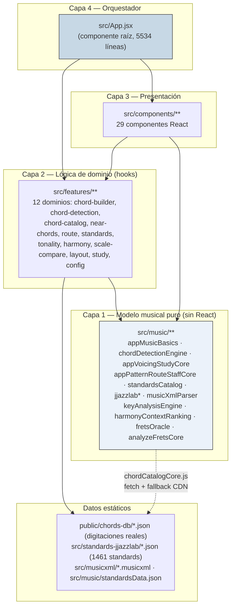
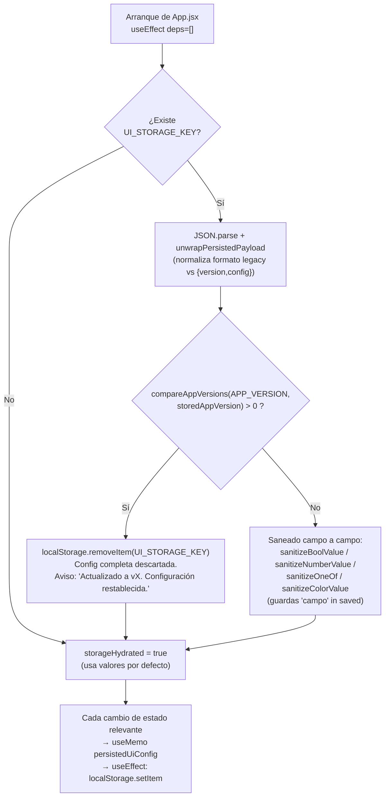
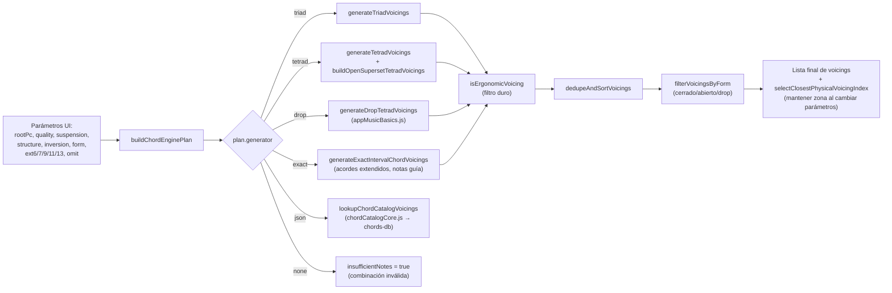
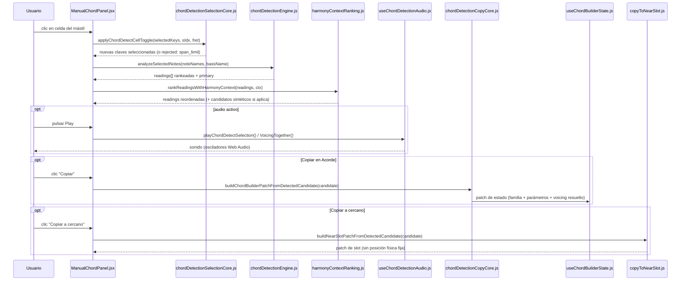

# Documento de Diseño Técnico del Software (DTS) — Mástil Escalas

> Repositorio: `a01653/mastil_escalas` · Paquete npm: `escalas` · Versión analizada: **6.0.94** (`package.json:4`, `src/App.jsx:303`)
> Fecha de análisis: 2026-08-17. Documento generado por auditoría directa del código fuente local, basado principalmente en revisión directa del código: lectura de configuración, estructura completa de `src/`, ejecución real de `npm test` y `npm run build`.
>
> **Revisión parcial 6.0.96** (2026-10-07, rama `feat/alteraciones-quinta-novena`, cierre técnico de la entrega): se revisaron y actualizaron las partes afectadas por los cambios de esta entrega — **variantes de quinta (♭5/5/♯5) y novena (♭9/9/♯9)**, **calidad visible y opción Aumentada**, **suspensión que conserva quinta y séptima**, **lecturas ♭9 y ♯5 del detector**, **explicaciones de opciones deshabilitadas consultables en móvil** y **cabecera del mástil de Acordes con rango de trastes** — en §4, §5.1-5.4, §6.2, §7.4 (§7.4.1), §7.6, §8.3, §8.7 (nuevo), §9, §12, §13, §14.2, §15, §16.1, §17 y §18. El resto del documento sigue describiendo la revisión 6.0.94 analizada originalmente; las cifras de líneas de ficheros no revisados no se han recalculado.

---

## 1. Objetivo y alcance

**Mástil Escalas** es una aplicación web de página única (SPA), en español, para el estudio interactivo del mástil de guitarra: escalas, patrones de digitación (CAGED, 3NPS, cajas de pentatónica), rutas melódicas, construcción y análisis de acordes (voicings), comparación de acordes cercanos con conducción práctica, y consulta de standards de jazz con sus cifrados armónicos (`README.md:1-9`).

El objetivo declarado por el propio proyecto (`README.md:78-87`) es servir de herramienta de apoyo al estudio de guitarra para: localizar notas en el mástil, entender intervalos y construcción de escalas, relacionar escalas con acordes, estudiar patrones reales de digitación, analizar inversiones/drops/voicings, y trabajar progresiones y acordes cercanos de forma visual.

**Alcance de este documento**: describe el estado real del código en la rama `main` (remoto `https://github.com/a01653/mastil_escalas.git`), tomando como base el commit `6ec9a1b` **más los cambios locales sin commitear presentes en el árbol de trabajo en el momento del análisis** — concretamente la reordenación de "Comparar" en la navegación y el ajuste del botón "Ayuda", en `src/App.jsx`, `src/components/layout/AppHeader.jsx`, `src/music/appStaticData.js` y `e2e/mobile-navigation.spec.js` —, verificado mediante lectura directa de ficheros y ejecución de la suite de tests y del build de producción. No cubre el histórico de decisiones de diseño no documentado en el código, ni funcionalidades planificadas que no tengan código ya implementado.

---

## 2. Arquitectura general

La aplicación es un **SPA cliente puro** sin backend propio: todo el cálculo musical (teoría, detección de acordes, generación de voicings, análisis de rutas) ocurre en el navegador, en JavaScript. No hay servidor de aplicación, API REST propia, ni base de datos; la persistencia es exclusivamente `localStorage`/`sessionStorage` del navegador (§6), y los datos "servidos" son ficheros estáticos (JSON de digitaciones, JSON/MusicXML de standards) desplegados junto al bundle.

### 2.1 Capas de código

El código fuente (`src/`) se organiza en **cuatro capas** con dependencias en una sola dirección (sin ciclos entre capas, aunque sí un caso de importación circular deliberada dentro de la capa de modelo, ver §7):


```mermaid
graph TD
    subgraph "Capa 4 — Orquestador"
        APP["src/App.jsx<br/>(componente raíz, 5534 líneas)"]
    end
    subgraph "Capa 3 — Presentación"
        COMP["src/components/**<br/>29 componentes React"]
    end
    subgraph "Capa 2 — Lógica de dominio (hooks)"
        FEAT["src/features/**<br/>12 dominios: chord-builder, chord-detection,<br/>chord-catalog, near-chords, route, standards,<br/>tonality, harmony, scale-compare, layout, study, config"]
    end
    subgraph "Capa 1 — Modelo musical puro (sin React)"
        MUSIC["src/music/**<br/>appMusicBasics · chordDetectionEngine · appVoicingStudyCore<br/>appPatternRouteStaffCore · standardsCatalog · jjazzlab* · musicXmlParser<br/>keyAnalysisEngine · harmonyContextRanking · fretsOracle · analyzeFretsCore"]
    end
    subgraph "Datos estáticos"
        DATA["public/chords-db/*.json (digitaciones reales)<br/>src/standards-jjazzlab/*.json (1461 standards)<br/>src/musicxml/*.musicxml · src/music/standardsData.json"]
    end

    APP --> COMP
    APP --> FEAT
    COMP --> FEAT
    FEAT --> MUSIC
    COMP --> MUSIC
    FEAT --> DATA
    MUSIC -.->|"chordCatalogCore.js<br/>fetch + fallback CDN"| DATA

    style APP fill:#c7d8e5,stroke:#333
    style MUSIC fill:#ebf2fa,stroke:#333
```

- **`src/music/`** (capa 1): funciones puras de teoría musical y análisis, sin dependencias de React ni del DOM (con la única excepción de `appPatternRouteStaffCore.jsx`, que además exporta un componente React `MusicStaff`). Es el núcleo testeable de forma aislada y reutilizado por scripts de auditoría (`scripts/*.mjs`) fuera del navegador.
- **`src/features/`** (capa 2): un hook `use<Dominio>Feature.js` por dominio funcional, que envuelve el modelo puro con `useState`/`useEffect`/`useMemo` de React y expone datos "listos para pintar" más acciones. Varios dominios separan explícitamente un fichero `*Core.js` puro (testeado con su `.test.js` homónimo) del hook con estado.
- **`src/components/`** (capa 3): componentes de presentación agrupados por dominio (`chords/`, `near-chords/`, `standards/`, `route/`, `study/`, `tonal/`, `config/`, `fretboard/`, `ui/`, `help/`, `layout/`). La mayoría no mantiene estado de negocio propio; reciben datos ya calculados por props agrupadas.
- **`src/App.jsx`** (capa 4): componente raíz único (`FretboardScalesPage`, `src/App.jsx:310`) que instancia los 7 hooks de dominio, mantiene el estado que no encaja en ningún hook de `features/` (persistencia, tema, presets, navegación), y ensambla el árbol de componentes final.

No existe una carpeta `src/hooks/` ni `src/services/` convencional: los hooks reutilizables viven dentro de `src/features/*/use*.js` (12 hooks de dominio) y dos hooks pequeños en `src/components/chords/` (`useChordPanelModel.js`, `useNearCopyFeedback.js`); el rol de "capa de servicios" lo cumple `src/features/chord-catalog/chordCatalogCore.js`, que es el único punto del código que hace `fetch()` a recursos externos al bundle.

### 2.2 Patrón arquitectónico observado

El patrón dominante es **"God component" orquestador + hooks de dominio + componentes tontos**: `App.jsx` concentra 52 `useState`, 26 `useEffect`, 44 `useMemo` y 6 `useCallback` propios (recuento directo por grep sobre el fichero), además de desestructurar agresivamente el estado devuelto por los 7 hooks de `features/` (p. ej. el hook del constructor de acordes se desestructura en 56 identificadores locales, `src/App.jsx:403-460`). El resultado se reparte a los paneles hijos como **objetos de props agrupados por dominio** (p. ej. `<ChordsPanel layout={...} chordCtrl={...} quartalCtrl={...} guideToneCtrl={...} uiCls={...} voicingData={...} detectArea={...} renderFns={...}>`, `src/App.jsx:5141-5207`).

Dentro de cada dominio de `features/` se repite un segundo patrón, más limpio: **núcleo puro + hook con estado**. Ejemplos verificados: `chordDetectionSelectionCore.js`/`useChordDetectionFeature.js`, `chordCatalogCore.js` (puro, sin hook propio — el estado de caché lo gestiona `App.jsx`), `copyToNearSlot.js`/`NearChordsPanel.jsx`, `scaleResolutionUtils.js`/`scaleCompareUtils.js`. Cada núcleo puro tiene un test unitario homónimo.

---

## 3. Tecnologías y dependencias

Extraído de `package.json` (verificado, no inferido):

| Categoría | Tecnología | Versión |
|---|---|---|
| Framework UI | React + react-dom | `^19.2.0` |
| Build tool | Vite | `^7.3.1` |
| Plugin React (Babel) | `@vitejs/plugin-react` | `^5.1.1` |
| CSS | Tailwind CSS (plugin Vite, **sin** `tailwind.config.js` — configuración CSS-first vía `@import "tailwindcss";` en `src/index.css:1`) | `^4.2.1` (`@tailwindcss/vite`) |
| Iconos | `lucide-react` | `^0.577.0` |
| Empaquetado móvil | Capacitor (`@capacitor/core`, `/android`, `/cli`) | `^8.4.1` |
| Testing unitario | Vitest + jsdom | `^4.1.5` / `^29.1.1` |
| Testing E2E | Playwright | `^1.60.0` |
| Linter | ESLint 9 (flat config) + `eslint-plugin-react-hooks` + `eslint-plugin-react-refresh` | `^9.39.1` |
| Otras devDependencies | `postcss`, `autoprefixer`, `puppeteer-core` (usado en `scripts/generateManual.mjs`) | — |

No hay gestor de estado global externo (Redux, Zustand, Context API de React tampoco se usa para estado compartido — todo el estado cruza por props desde `App.jsx`), ni router (aplicación de una sola vista con navegación por pestañas controlada por estado local), ni ORM/backend.

**Target de build**: `es2018` (`vite.config.js:22`). **Base pública**: `/mastil_escalas/` para el despliegue web (`vite.config.js:9`, GitHub Pages) y `./` para el empaquetado Android (`vite.config.android.js:9`, WebView de Capacitor sirviendo ficheros locales).

---

## 4. Estructura del proyecto

```
mastil_escalas/
├── src/
│   ├── App.jsx                  # Componente raíz (5590 líneas en 6.0.96), único punto de entrada visual
│   ├── main.jsx                 # Bootstrap de React + error boundary + pantalla de carga
│   ├── App.css / index.css      # Estilos globales; index.css solo importa Tailwind v4
│   ├── App.smoke.test.jsx       # Test de humo del montaje de App
│   ├── components/              # 33 componentes de presentación, agrupados por dominio
│   │   ├── layout/  fretboard/  ui/  help/  standards/  route/  study/
│   │   ├── chords/  tonal/  config/  near-chords/  PanelBlock.jsx
│   ├── features/                # 13 dominios de lógica (hooks + núcleos puros)
│   │   ├── chord-builder/  chord-detection/  chord-catalog/  near-chords/
│   │   ├── route/  standards/  tonality/  harmony/  scale-compare/
│   │   ├── layout/  study/  config/  fret-window/ (6.0.96)
│   ├── music/                   # Modelo musical puro (20 módulos .js/.jsx + tests; chordAlterations.js desde 6.0.96)
│   ├── utils/configIo.js        # Serialización de export/import de configuración
│   ├── standards-jjazzlab/      # 1461 ficheros JSON de standards (fuente JJazzLab)
│   └── musicxml/                # Cientos de ficheros .musicxml (fuente alternativa)
├── public/chords-db/            # Base de datos física de digitaciones reales (JSON por nota)
├── scripts/                     # Auditorías, generadores y CLIs de análisis (Node, .mjs)
├── e2e/                         # 34 specs de Playwright (+ helpers/appVersion.js)
├── android/, capacitor.config.json, vite.config.android.js   # Empaquetado Android
├── docs/frets-oracle.md         # Documentación de la batería de validación del lector de voicings
├── .github/workflows/deploy-pages.yml   # CI/CD a GitHub Pages
├── vite.config.js, eslint.config.js, playwright.config.js
└── package.json
```

No existe `README` de arquitectura previo a este DTS más allá del `README.md` de producto (orientado a usuario final) y `docs/frets-oracle.md` (documentación específica de la batería de validación del motor de lectura de voicings).

---

## 5. Componentes principales y responsabilidades

### 5.1 Layout y navegación

| Componente | Responsabilidad |
|---|---|
| `components/layout/AppHeader.jsx` | Cabecera: título, badge de versión, menú hamburguesa móvil, barra de navegación de escritorio (un `ToggleButton` por sección), botón de ayuda (abre `ManualOverlay`), y el `<input type="file">` oculto real para importar configuración (ver §12). |
| `components/layout/AppFooter.jsx` | Pie estático con crédito de autoría. |
| `components/help/ManualOverlay.jsx` | Modal de manual de uso, contenido 100% estático en español. |
| `components/help/MobileInfoPopover.jsx` | Popover de ayuda contextual táctil, posicionado dinámicamente junto al icono ⓘ de origen. Desde 6.0.96 se pinta por encima de los editores modales y de los overlays (`z-[130]`/`z-[131]`), de modo que la ayuda abierta desde un editor móvil se ve y se puede cerrar. |
| `components/PanelBlock.jsx` | Contenedor "átomo de layout" (sección/subsección con cabecera coloreada y cuerpo colapsable) reutilizado por prácticamente todos los paneles. |

### 5.2 Mástil y primitivas visuales

| Componente | Responsabilidad |
|---|---|
| `components/fretboard/FretboardShared.jsx` | Piezas de mástil de escritorio: nota al pasar el ratón, fila de incrustaciones, cabecera numérica de traste. |
| `components/fretboard/MobileMainFretboard.jsx` | Mástil vertical genérico para layout móvil; el contenido de cada celda se delega en un callback `renderCell`, reutilizado por acordes, ruta y acordes cercanos. |
| `components/fretboard/ChordVoicingFretboards.jsx` | `ChordFretboard`/`GuideToneFretboard`: mástiles especializados en pintar un *voicing* coloreando por rol armónico o por rol de notas guía; desde 6.0.96 sombrean el rango de trastes activo (solo visual, §8.7). |
| `components/fretboard/FretWindowControls.jsx` | Controles de la ventana de trastes «Rango ◀ Tamaño ▶ desde–hasta» (y, si se le pasa, «Todo el mástil»), compartidos por los mástiles de Acordes y Acordes cercanos; cada panel aporta su propio estado (§8.7). |
| `components/fretboard/FretNoteMarker.jsx` | Marcador circular de nota genérico, base de los clústeres superpuestos de Acordes cercanos. |
| `components/ui/AppUiPrimitives.jsx` | `ToggleButton`, `InfoTitle` — primitivas compartidas. |
| `components/ui/ColorPickerPopover.jsx` + `colorUtils.js` | Selector de color propio (HSV, sin `<input type=color]` nativo), con flujo de borrador (Aceptar/Cancelar). |

### 5.3 Acordes

| Componente | Responsabilidad |
|---|---|
| `components/chords/ChordsPanel.jsx` (959 líneas) | Panel "Acorde": constructor tonal/cuartal/notas guía, controles de calidad/estructura/forma/inversión/extensiones/quinta-novena/omisión con botón ⓘ de explicaciones, navegador de voicings, cabecera del mástil (§8.7) y mástiles de acorde, aviso explícito cuando el acorde tiene más de 6 notas distintas o cuando el rango deja fuera todas las posiciones. |
| `components/chords/ManualChordPanel.jsx` (841 líneas) | Modo Manual ("Investigar en mástil"): selección de notas en el mástil, lecturas detectadas agrupadas en principales/avanzadas, lecturas extra del oráculo bajo demanda, reproducción de audio, "Copiar a cercano". |
| `components/chords/useChordPanelModel.js` | Hook de lógica de pantalla del constructor (handlers de tono, calidad, suspensión, extensiones, forma) y opciones de los combos Calidad y Sus con sus explicaciones (`chordQualitySelectOptions`, `chordSuspensionSelectOptions`, `buildChordControlHints`). |
| `components/chords/useNearCopyFeedback.js` | Feedback visual temporal (1.5 s) tras copiar una lectura a un slot cercano. |
| `components/chords/ChordAlterationSelects.jsx` | Selectores compartidos **Quinta** (♭5/5/♯5) y **Novena** (♭9/9/♯9) usados por Acorde y por cada slot de Acordes cercanos (escritorio y móvil). No contienen política propia: muestran las opciones, el estado habilitado y el texto de ayuda que devuelve `chordAlterations.js` (§7.4.1). |
| `components/chords/ChordHintList.jsx` | Lista de explicaciones de las opciones deshabilitadas de un control (un término en negrita por línea), que Acorde y cada slot cercano muestran en el botón ⓘ de «Calidad / Sus», «Quinta / Novena» y «Extensiones» (§7.4.1). |
| `components/chords/ChordFretboardHeader.jsx` | Cabecera del mástil de Acordes: «Mástil ⓘ», interruptores con icono de cuerdas al aire y zona anterior, y controles de rango con «Todo el mástil»; en móvil solo «Mástil ⓘ» y los iconos (§8.7). |

### 5.4 Acordes cercanos y análisis de tonalidad

| Componente | Responsabilidad |
|---|---|
| `components/near-chords/NearChordsPanel.jsx` (614 líneas) | Orquestador: selector de estilo/progresión, toggle "Auto escala", los 4 `NearChordSlot`, y el mástil compartido con clústeres de hasta 4 notas superpuestas por celda; la ventana de trastes usa `FretWindowControls` y `computeFretWindow` (§8.7, §9). |
| `components/near-chords/NearChordSlot.jsx` (830 líneas) | Editor de un slot: bifurca la UI según familia (terciana/cuartal/notas guía), combos de Calidad y Sus y selectores de quinta/novena con la misma política y las mismas explicaciones (ⓘ) que Acorde, navegador de voicings, distancia máxima, cuerdas al aire. |
| `components/near-chords/KeyProgressionAnalyzer.jsx` (686 líneas) | Acordeón de análisis de tonalidad sobre una progresión pegada por el usuario: tonalidades detectadas, centros modales compatibles. |

### 5.5 Contexto tonal, estudio y standards

| Componente | Responsabilidad |
|---|---|
| `components/tonal/TonalContextPanel.jsx` | Raíz, notación, escala, armonización, notas extra, cajas de blues. |
| `components/study/StudyPanel.jsx` (974 líneas) | "Modo estudio": identidad y acorde relativo, reglas de construcción, compatibilidad armónica, función en números romanos, guía de sustituciones (5 pestañas), exportación a PDF. |
| `components/standards/StandardsPanel.jsx` + 6 subcomponentes | Catálogo filtrable, ficha de metadatos, "forma" del tema con cifrado por compás y selección de hasta 4 eventos para enviar a Acordes cercanos. |
| `components/route/RouteLabFretboard.jsx` | Mástil del laboratorio de rutas: escala activa + ruta calculada superpuesta, modo debug con traza paso a paso. |
| `components/config/AppConfigPanel.jsx` | Panel "Configuración" (ver §12). |

---

## 6. Gestión del estado y persistencia

### 6.1 Modelo de estado

No hay `useReducer` ni store externo: **todo el estado es `useState` distribuido**, agrupado en 7 hooks de dominio (`useTonalityFeature`, `useMobileLayoutFeature`, `useChordBuilderState`, `useChordDetectionFeature`, `useRouteFeature`, `useHarmonyFeature`, `useStandardsFeature`) más el estado propio de `App.jsx` para lo que no encaja en ningún dominio (persistencia, tema, presets, colores, comparador de escalas, King Boxes de blues).

### 6.2 Persistencia en navegador

Tres claves de almacenamiento, definidas en `src/App.jsx:298-303`:

| Clave | Storage | Contenido |
|---|---|---|
| `mastil_interactivo_guitarra_config_v1` | `localStorage` | Payload completo de configuración (~90 campos): escala, notación, King Boxes, acorde principal completo (terciano+cuartal+notas guía), detección de acordes, acorde de referencia, 4 slots de acordes cercanos, key-analyzer, ruta/route-lab, colores y tema. |
| `mastil_interactivo_guitarra_presets_v1` | `localStorage` | Hasta `QUICK_PRESET_COUNT = 3` presets rápidos, cada uno `{name, savedAt, payload}` con el mismo formato que la config principal. |
| `mastil_interactivo_guitarra_status_v1` | `sessionStorage` | Aviso de un solo uso que sobrevive a un `reload()` forzado (tras importar, restablecer o cargar un preset), leído y borrado al arrancar. |


```mermaid
flowchart TD
    A["Arranque de App.jsx<br/>useEffect deps=[]"] --> B{"¿Existe<br/>UI_STORAGE_KEY?"}
    B -- No --> Z["storageHydrated = true<br/>(usa valores por defecto)"]
    B -- Sí --> C["JSON.parse + unwrapPersistedPayload<br/>(normaliza formato legacy vs {version,config})"]
    C --> D{"compareAppVersions(APP_VERSION,<br/>storedAppVersion) > 0 ?"}
    D -- Sí --> E["localStorage.removeItem(UI_STORAGE_KEY)<br/>Config completa descartada.<br/>Aviso: 'Actualizado a vX. Configuración restablecida.'"]
    D -- No --> F["Saneado campo a campo:<br/>sanitizeBoolValue / sanitizeNumberValue /<br/>sanitizeOneOf / sanitizeColorValue<br/>(guardas 'campo' in saved)"]
    E --> Z
    F --> Z
    Z --> G["Cada cambio de estado relevante<br/>→ useMemo persistedUiConfig<br/>→ useEffect: localStorage.setItem"]
```

Puntos verificados relevantes:

- **Migración por versión de app es "todo o nada"**: si `APP_VERSION` (`6.0.96` en esta revisión) es mayor que la versión que generó la config guardada, la config **se borra íntegramente** (`src/App.jsx:1118-1124`) — no hay migración incremental campo a campo entre versiones de la app. La migración incremental sí existe, pero para el campo `version` interno del payload (`UI_CONFIG_VERSION = 1`, distinto de `APP_VERSION`): si difiere, solo se muestra un aviso informativo y se aplica saneado defensivo campo a campo sin descartar nada (`src/App.jsx:1116-1298`).
- **Saneado sistemático**: todas las lecturas usan una vocabulario común de validadores puros de `src/music/appPatternRouteStaffCore.jsx` (`sanitizeBoolValue`, `sanitizeNumberValue`, `sanitizeOneOf`, `sanitizeColorValue`, `sanitizeNearSlotValue`, `sanitizePresetCollection`), de forma que una config corrupta o de formato antiguo nunca rompe el arranque; en el peor caso cae a valores por defecto campo a campo.
- **Alteraciones de quinta y novena (6.0.96)**: el acorde principal persiste `chordFifth` (`"b5" | "5" | "#5"`) y `chordNinth` (`"b9" | "9" | "#9"`), saneados con `sanitizeOneOf` contra `CHORD_FIFTH_VALUES`/`CHORD_NINTH_VALUES`; cada slot cercano persiste `fifth`/`ninth` mediante `sanitizeNearSlotValue`. Una configuración, preset o exportación **sin estos campos** (formato anterior) carga con la quinta propia de la calidad y la novena natural, es decir, con el mismo acorde que antes; los slots **no heredan** la alteración del acorde principal ni de otro slot. Tras cargar, una alteración incompatible con el resto del estado vuelve al valor por defecto mediante `buildChordStateNormalizationPatch` (nunca se reinterpreta como otra alteración). La subida a 6.0.96 descarta la config guardada por la regla "todo o nada" del punto anterior. Los presets rápidos, en cambio, se conservan: al arrancar, `sanitizePresetCollection` los re-etiqueta con la versión actual, de modo que cargar uno guardado con una versión anterior aplica su configuración (con quinta y novena por defecto) en lugar de restablecerla (E2E `CVI-6`). La exportación/importación explícita también conserva las alteraciones (cubierto por E2E).
- **Calidad y suspensión (6.0.96)**: «Aumentada» no se guarda nunca (es una etiqueta del combo): el estado guarda Mayor o Dominante con `chordFifth = "#5"` y la restauración solo admite `CHORD_STORED_QUALITY_VALUES` (`maj, dom, min, minmaj7, dim, hdim`). Una configuración con Disminuido + suspensión + 7ª (no alcanzable desde la interfaz) se normaliza conservando la ♭♭7 y recuperando la 3ª.
- **Rango de trastes de Acordes (6.0.96)**: `chordWindowStart` (0-24) y `chordWindowSize` (1-24) se guardan con `sanitizeNumberValue`. Sin estos campos (configuraciones, presets o ficheros anteriores) se usa `FULL_NECK_WINDOW` (inicio 1, tamaño 24, recortado al último traste configurado), es decir, todo el mástil, como antes. «Todo el mástil» vuelve a ese mismo estado y se guarda con la persistencia habitual. En móvil el rango no se aplica pero tampoco se modifica (§8.7). Es independiente de `nearWindowStart`/`nearWindowSize`.
- **Campo no persistido detectado**: `chordDetectClickAudio` (mute del sonido al pulsar celdas en el modo Manual) no aparece en la lista de ~90 campos de `persistedUiConfig` (`src/App.jsx:850-953`) — el estado de mute del audio de detección **no sobrevive a un recargado de página** (ver también §11 y §17).

---

## 7. Modelo musical: notas, intervalos, escalas, patrones y acordes

### 7.1 Representación de alturas

Las clases de altura (*pitch classes*) son enteros `0..11` con `C = 0`. `mod12(n)` (`src/music/appMusicBasics.js:25`) normaliza cualquier entero. La enarmonía se controla mediante un flag `preferSharps: boolean` que acompaña al pitch class en casi toda la API: `pcToName(pc, preferSharps)`, `pcToDualName(pc)` (devuelve `"C#/Db"` salvo notas naturales), `chordUiLetterFromPc(pc, preferSharps)` (letra base para el selector de tono).

`pitchAt(sIdx, fret)` (`appMusicBasics.js:58`) traduce cuerda+traste a altura MIDI absoluta sumando el traste al MIDI de cuerda al aire (`OPEN_MIDI`, `appStaticData.js:276`, afinación estándar E2-A2-D3-G3-B3-E4). `noteNameToPc(token)` hace el camino inverso, admitiendo dobles alteraciones (`F##`, `Gbb`).

El deletreo letra-a-letra real (para mostrar `C#` vs `Db` correctamente según el contexto) se calcula con `spellNoteFromChordInterval`/`spellChordNotes`/`spellPcWithLetter` (`appMusicBasics.js:817-1660`). **Nota de diseño verificada**: estas mismas funciones de deletreo están *duplicadas* de forma independiente en `chordDetectionEngine.js:76-106`, porque ese módulo tiene la restricción arquitectónica de no importar de ningún otro módulo de `src/music/` (es la capa 0 explícita del sistema).

### 7.2 Escalas

`SCALE_PRESETS` (`appStaticData.js:107`) es un diccionario de ~30 escalas → array de intervalos: pentatónicas mayor/menor, mayor/menor natural, los 7 modos griegos, menor armónica/melódica, mayor armónica, doble armónica/bizantina, frigia mayor, lidia dominante, alterada, húngara menor gitana, 7 escalas bebop de 8 notas, pentatónicas con *blue note*, hirajoshi, tonos enteros, disminuidas H-W/W-H, y `"Personalizada"` (intervalos libres introducidos por el usuario). La armonización diatónica en tétradas de cada grado se construye con `buildHarmonyDegreeChord` (`appMusicBasics.js:537`), con una excepción explícita para **armonía funcional menor** (fuerza V7 en vez de v cuando `harmonyMode === "functional_minor"`).

Para escalas cuya cifra diatónica estándar (apilar terceras) no produce resultados musicalmente correctos (pentatónicas, bebop, húngara gitana, doble armónica), existe una tabla de armonizaciones curadas a mano: `MANUAL_SCALE_TETRAD_PRESETS`/`MANUAL_SCALE_HARMONY_PRESETS` (`appStaticData.js:175-263`).

### 7.3 Patrones sobre el mástil (`appPatternRouteStaffCore.jsx`)

- **3NPS** (`build3NpsPatternsMerged`/`build3NpsPatternInstances`): para escalas de 7 notas, 3 notas por cuerda, 7 posiciones (una por grado).
- **CAGED** (`buildCagedPatternInstances`/`pickCagedViewPatterns`): 5 formas ancladas en 4ª/5ª/6ª cuerda según la letra (`CAGED_DEFS`), funcional con cualquier escala/modo (no solo mayor), no solo con acordes.
- **Cajas de pentatónica** (`buildPentatonicBoxInstances`): ventanas de 5 trastes con offsets predefinidos distintos para pentatónica mayor (`[0,2,4,7,9]`) y menor (`[0,3,5,7,10]`).
- 2NPS existe en el código (`_build2NpsPatternsMerged`) pero no se usa activamente en la ruta principal actual (mantenido por compatibilidad).

### 7.4 Motor de acordes: nombres, sufijos e intervalos

`chordSuffixFromUI(...)` (`appMusicBasics.js:150`) traduce el estado de la UI (calidad/suspensión/estructura/extensiones/alteraciones) a un sufijo interno, que también es la clave de la base de datos JSON; `chordDisplayNameFromUI(...)` (línea 592) compone el nombre final mostrado, con reclasificación de tríada-con-7ª-marcada como cuatriada de facto y notación `(addN,...)` cuando hace falta representar tensiones sin las intermedias.

Desde 6.0.96 hay **una única definición de las notas del acorde**: `buildChordToneDefinition(...)` (línea 1623) devuelve los grados `{interval, label, role}` (además de `intervals`, `degreeLabels`, `roles` y los offsets de 3ª/5ª/7ª/9ª) a partir del estado normalizado por `normalizeChordUiSpec(...)` (línea 1591). La consumen el nombre (`chordDisplaySuffixFromSpec`, que lee las extensiones **de los grados realmente presentes**, no de los checkboxes), los chips, las inversiones y el bajo, el mástil, el deletreo (`spellChordNotes` con `degreeLabels`), el plan de voicings (§8.2), Acordes cercanos y el Modo estudio. `buildChordIntervals(...)` (línea 1704) es ahora un envoltorio que devuelve `definition.intervals`. Se mantiene el modelo de "slots" para tétradas (7ª ocupa 1 slot, cada *add* ocupa 1 slot más, máximo 1-2 según `omit`); si dos grados comparten clase de altura prevalece el primero en orden estructural (excepción: con 6 y 13 marcadas prevalece la 13), y la omisión se aplica al final.

La definición **conserva el grado junto al semitono**: ♯9 no se convierte en ♭3, ♯5 no se convierte en ♭13 y ♭♭7 (dim7) no se convierte en 6, aunque compartan altura. Por eso el deletreo, las etiquetas de bajo (`Bajo b9`, `Bajo bb7`) y el estudio usan la etiqueta funcional y no la del semitono (p. ej. `G7(#9)` deletrea la ♯9 como `A#`, no `Bb`; `Fdim7` deletrea la ♭♭7 como `Ebb`).

**Catálogos de UI verificados** (`appMusicBasics.js:1231-1560`): `CHORD_QUALITIES` = `maj, dom, aug, min, minmaj7, dim, hdim` (`aug` = «Aumentada», solo etiqueta del combo: se guarda como `maj`/`dom` con ♯5; las calidades guardables son `CHORD_STORED_QUALITY_VALUES`); `CHORD_STRUCTURES` = `triad, tetrad, chord`; `CHORD_FAMILIES` = `tertian, quartal, guide_tones`; `CHORD_INVERSIONS` = `root, 1, 2, 3, all`; `CHORD_FORMS` = `closed, open` + 6 formas drop (`drop2_set1/2/3`, `drop3_set1/2`, `drop24_set1/2`).

#### 7.4.1 Quinta, novena, calidad visible y suspensión (`chordAlterations.js`, 6.0.96)

El estado del acorde (principal y de cada slot cercano) añade dos campos explícitos a los booleanos existentes de calidad, suspensión y extensiones, que **no cambian de significado**:

| Campo | Valores | Semitonos | Efecto |
|---|---|---|---|
| `fifth` | `"b5"`, `"5"`, `"#5"` | 6, 7, 8 | **Sustituye** a la quinta de la calidad (no se añade). |
| `ninth` | `"b9"`, `"9"`, `"#9"` | 1, 2, 3 | Solo actúa con `ext9`; **sustituye** a la novena natural. |

`src/music/chordAlterations.js` es un módulo de capa 0 (no importa de ningún otro) y concentra **toda la política** de calidad, quinta, novena y suspensión, para poder ampliarla sin tocar los consumidores:

- **Calidad base, teórica y mostrada.** `quality` del estado es la calidad *base* elegida: fija la 3ª y el tipo de 7ª (Mayor/m(maj7) → 7ª mayor; Dominante/Menor/Semidisminuido → ♭7; Disminuido → ♭♭7) y cambiar la quinta o la novena nunca la reescribe. `resolveTheoryChordQuality` da la calidad *teórica* que usan nombre, notas, sufijo del catálogo, plan, voicings, inversiones y estudio (Menor + 7 + ♭5 = `hdim`; Menor + ♭5 sin 7ª = `dim`; nunca `Adim7` desde Menor). `resolveDisplayChordQuality` da la que muestra el combo, siempre a partir de las notas reales: m7 + ♭5 → m7(b5); ø + 5 o ♯5 → Menor (`Am7`, `Am7(#5)`; nunca m7(b5) con ♯5); 3ª mayor + ♯5 → **Aumentada** (`Caug`, `C7(#5)`, `Cmaj7(#5)`). `normalizeChordUiSpec` devuelve las tres (`quality`, `uiQuality`, `displayQuality`) y `buildChordStateNormalizationPatch` solo escribe de vuelta la base.
- **La calidad no bloquea los selectores.** `allowedChordFifths` ofrece ♭5/5/♯5 mientras exista el grado 5 y no esté omitido, en cualquier calidad y también con suspensión (en dim7 la quinta justa se nombra `♮5`). `allowedChordNinths` ofrece ♭9/9/♯9 con la extensión 9 activa (no en tríada); con 3ª menor la ♯9 coincide en altura con la ♭3 y no añadiría ninguna nota, así que esa opción concreta se deshabilita con su explicación (limitación del constructor, que trabaja por clases de altura).
- **Aumentada** es una opción del combo, no un valor guardado: `buildChordQualityChangePatch(state, "aug")` guarda Mayor o Dominante con ♯5 conservando el tipo de 7ª (`storedQualityForAugmented`: Cm7 → `C7(#5)`, Cm(maj7) → `Cmaj7(#5)`). `chordAugmentedOptionState` la deshabilita con su explicación cuando no puede conservar la séptima —Disminuido con 7ª pediría 1–3–♯5–♭♭7, un acorde válido que el constructor aún no representa— o con «Omitir 5» (no hay quinta que aumentar); en esos casos el patch es vacío y el acorde no cambia. Sin 7ª, Disminuido → Aumentada da `Caug` y, si después se activa la 7, `C7(#5)`.
- **Suspensión.** sus2/sus4 solo sustituyen la 3ª: `buildChordSuspensionChangePatch` no toca calidad base, quinta, séptima ni extensiones, y al quitar la suspensión vuelve el acorde exacto (`Cm7(b5)` ⇄ `C7sus4(b5)` = C–F–G♭–B♭; `Cm9(b5)` ⇄ `C9sus4(b5)`; `Cdim` ⇄ `Csus4(b5)`). `chordSuspensionOptionState` deshabilita sus2/sus4 con su explicación en Disminuido con 7ª (1–4–♭5–♭♭7 no se representa ni se nombra; nunca se sustituye por otra séptima) y con «Omitir 3» (no hay tercera que sustituir). Con Disminuido suspendido la 7 no se puede activar (`chordSeventhBlockedBySuspension` en `buildChordUiRestrictions`) y entrar en Cuatriada no la activa. Elegir Disminuido o Semidisminuido en el combo sigue quitando la suspensión, porque es una elección de 3ª.
- **Explicaciones consultables.** `buildChordControlHints(state)` (`appVoicingStudyCore.js`) agrupa las explicaciones de lo deshabilitado por control (Calidad / Sus, Quinta / Novena, Extensiones). Acorde y cada slot cercano las muestran en el botón ⓘ de cada etiqueta (`ChordHintList.jsx` + `InfoTitle` → `MobileInfoPopover`), que solo aparece si hay algo deshabilitado y se consulta pulsando, también en móvil; cada opción conserva además su `title`.
- `normalizeChordAlterations(...)` devuelve al valor por defecto cualquier alteración que el estado no admita; **nunca la reinterpreta como otra**. Las transiciones de la UI pasan por `buildChordQualityChangePatch`, `buildChordSuspensionChangePatch`, `buildChordExtensionTogglePatch` y `buildChordStateNormalizationPatch` (`appVoicingStudyCore.js`), compartidos por Acorde y Acordes cercanos. Al elegir otra calidad, la quinta implícita de Disminuido/Semidisminuido no se arrastra como alteración, mientras que una quinta elegida explícitamente se conserva si con ella el combo sigue mostrando la opción elegida. Elegir «Dominante (7)» en estructura Acorde activa la 7ª en los dos paneles.

**Nombre canónico** (verificado con `chordDisplayNameFromUI`):

| Estado | Nombre | Grados |
|---|---|---|
| Mayor, tríada, ♯5 / ♭5 | `Caug` / `C(b5)` | `1,3,#5` / `1,3,b5` |
| Mayor, cuatriada, ♯5 / ♭5 | `Cmaj7(#5)` / `Cmaj7(b5)` | `1,3,#5,7` / `1,3,b5,7` |
| Dominante, cuatriada, ♯5 / ♭5 | `G7(#5)` / `C7(b5)` | `1,3,#5,b7` / `1,3,b5,b7` |
| Dominante, Acorde, 9 = ♭9 / ♯9 | `D7(b9)` / `E7(#9)` | `1,b9,3,5,b7` / `1,#9,3,5,b7` |
| Dominante, ♯5 + ♭9 (= G+7(♭9)) | `G7(#5,b9)` | `1,b9,3,#5,b7` |
| Dominante, ♯5 + 9 natural | `C9(#5)` | `1,9,3,#5,b7` |
| Cuatriada dominante, Omitir 5, 9 = ♭9 / ♯9 | `D7(b9,no5)` / `E7(#9,no5)` | `1,b9,3,b7` / `1,#9,3,b7` |
| m7(♭5) / con 9 | `Am7(b5)` / `Am9(b5)` | `1,b3,b5,b7` / `1,9,b3,b5,b7` |
| dim7 / con 9 | `Fdim7` / `Fdim7(add9)` | `1,b3,b5,bb7` / `1,9,b3,b5,bb7` |
| Menor + ♭5 sin 7ª / con 7ª | `Adim` / `Am7(b5)` | `1,b3,b5` / `1,b3,b5,b7` |
| Disminuido sin 7ª + 6 / + 9 + 11 | `Adim(add6)` / `Adim(add9,11)` | `1,b3,b5,6` / `1,9,b3,11,b5` |
| Dominante sus4 / con 9 / con ♭9 | `D7sus4` / `D9sus4` / `D7sus4(b9)` | `1,4,5,b7` / `1,9,4,5,b7` / `1,b9,4,5,b7` |
| Menor + ♯5: tríada / con 7ª / m(maj7) | `Cm(#5)` / `Am7(#5)` / `Cm(maj7,#5)` | `1,b3,#5` / `1,b3,#5,b7` / `1,b3,#5,7` |
| Menor, m7(♭5) y dim7 con ♭9 | `Am7(b9)` / `Am7(b5,b9)` / `Adim7(b9)` | `1,b9,b3,5,b7` / `1,b9,b3,b5,b7` / `1,b9,b3,b5,bb7` |
| Mayor con 7ª, 9 = ♯9 / ♭9 | `Cmaj7(#9)` / `Cmaj7(b9)` | `1,#9,3,5,7` / `1,b9,3,5,7` |
| m(maj7) + ♭5 / dim7 + 5 justa | `Am(maj7,b5)` / `Adim7(♮5)` | `1,b3,b5,7` / `1,b3,5,bb7` |
| Aumentada desde Cm7 / desde Cm(maj7) | `C7(#5)` / `Cmaj7(#5)` | `1,3,#5,b7` / `1,3,#5,7` |
| ø + sus4 / + sus2; Disminuido tríada + sus4 | `C7sus4(b5)` / `C7sus2(b5)`; `Csus4(b5)` | `1,4,b5,b7` / `1,2,b5,b7`; `1,4,b5` |

Las alteraciones se escriben entre paréntesis detrás del sufijo base, la quinta antes que la novena; la ♯9 conserva la 3ª mayor. Una quinta justa que sustituye a la ♭5 propia de dim7 se escribe `♮5` (`Adim7(♮5)`, que conserva su ♭♭7 y no se reinterpreta como `Am6`). Con suspensión la base solo aporta el tipo de 7ª: Menor y Dominante convergen en el mismo sufijo (`Dm7(sus4)` se nombra `D7sus4`, no `Dm7(add11)`) y el semidisminuido suspendido es `7sus4(b5)`. Sin 7ª, Disminuido con 6 o con varias extensiones añadidas conserva `dim` en el nombre (`Adim(add6)`, `Adim(add9,11)`; antes salían `A6` y `Aadd9,11`, nombres de otros acordes). En dim7 las extensiones 6 y 13 se deshabilitan con explicación: coinciden en altura con la ♭♭7 y el modelo de grados de la app no puede representar dos funciones en la misma clase de altura (limitación de representación, no regla musical).

**Generación**: cualquier acorde con quinta o novena alterada devuelve `chordCanUseJsonCatalog = false` y usa el **generador exacto** por intervalos (§8.2), porque la base de datos JSON no garantiza esas fórmulas. Un acorde con más de 6 notas distintas no se fuerza a una forma menor: el plan lo marca (`tooManyNotes`) y la UI explica que hay que usar "Omitir" o desactivar alguna extensión.

### 7.5 Estructuras cuartales y notas guía

Las estructuras cuartales (`fnBuildQuartalPitchSets`, `appMusicBasics.js:1219`) se construyen apilando cuartas justas desde la raíz (`type="pure"`) o alterando una cuarta a tritono (`type="mixed"`), o bien siguiendo la escala activa en pasos de 3 grados diatónicos (`reference="scale"`), clasificando el resultado como `pure`/`mixed` según si algún paso es de 6 semitonos. Las notas guía (`guideToneDefinitionFromQuality`, línea 1138) modelan *shells* de 3 notas para `min7/dom7/maj6/maj7` (p. ej. `min7 → intervalos [0,3,10]`, etiquetas `1,b3,b7`).

### 7.6 Motor de detección de acordes (`chordDetectionEngine.js`)

Es el módulo de menor nivel del sistema: no importa de ningún otro módulo de `src/music/` (confirmado por lectura completa), y exporta `noteNameToPc`/`preferSharpsFromMajorTonicPc` consumidos por el resto. Punto de entrada: `detectChordReadings(selectedNotes)` (línea 1399), que combina tres generadores de candidatos:

1. **Fórmulas catalogadas** (`collectFormulaCandidates`, línea 1056): recorre `CHORD_DETECT_FORMULAS` (~60 fórmulas, línea 117), exige ≥2 (díada) o ≥3 coincidencias con tolerancia de 1 grado ausente.
2. **Cuartales manuales** (`buildQuartalManualCandidates`, línea 613): cadenas de cuartas (pasos de 5-6 semitonos) entre las notas seleccionadas.
3. **Heurística terciana general** (`buildHeuristicTertianCandidates`, línea 797): deduce calidad por presencia de 3ª/5ª/7ª y compone tensiones (9, 11, 13, #9, b13, #11) para conjuntos de notas sin fórmula catalogada exacta, incluyendo el caso de dominante alterada.

El **ranking** (`candidateProbabilityScore`, línea 497) combina penalización por complejidad de fórmula, por grados omitidos (+9, +5 extra si es la 3ª), por 5ª alterada no estructural (+8), y un modelo explícito de peso para bajo tipo *slash* (-8 si tríada exacta con bajo externo). Tras el ranking, un pipeline adicional filtra candidatos contradictorios, colapsa "gemelos enarmónicos" preservando el deletreo con menos alteraciones, deduplica por contenido semántico, filtra bajos "raros" (`B#/E#/Cb/Fb`) cuando hay alternativa más limpia, recorta a 12 resultados y decora alias especiales (*Hendrix chord*, *Mystic chord*, *James Bond chord*, *So What chord*).

**Cambios de 6.0.96 (quinta/novena alteradas)**:

- Fórmulas nuevas o revisadas en `CHORD_DETECT_FORMULAS` con su `ui` completo (incluidos `fifth`/`ninth`), de modo que la lectura sea copiable sin perder notas: `7(b9)`, `7(#9)`, `7(#5,b9)`, `7(#5,#9)`, `7(b5,b9)`, `7(b5,#9)`, `9(#5)`, `9(b5)`, `7sus4(b9)`, `9sus4`, `maj7(#5)`, `maj7(b5)`, `7(#5)`, `7(b5)`, `(b5)`, `m9(b5)` y las variantes sin quinta `7(#9,no5)`/`7(b9,no5)`. Catorce de ellas (`aug`, `(b5)`, `9sus4`, `7sus4(b9)`, `7(b9)`, las cuatro dobles alteraciones, `9(#5)`, `9(b5)`, `maj7(b5)`, `7(b9,no5)` y `m9(b5)`) llevan `requireExact`: no generan lecturas parciales con grados ausentes (evita regresiones como `D#9(b5,no3)` sobre voicings ajenos).
- Nomenclatura: con 7ª, la ♭2 se nombra ♭9 en cualquier calidad (`D7(b9)`, `Am7(b9)`, `Am7(b5,b9)`, `Cmaj7(b9)`); sin 7ª sigue siendo un añadido (`Am(addb2)`, no se renombra toda ♭2 como ♭9). Una 3ª menor junto a la 3ª mayor es ♯9; sin 5ª justa la ♭6 de un dominante se lee ♯5 (`C7(#5,#9)` en lugar de `C7(#9,b13,no5)`), y con 5ª justa presente sigue siendo ♭13. Sin 5ª justa, la lectura con ♭13 y `no5` se conserva como **alternativa** de la misma raíz (`C7(#5)` → `C7(b13,no5)`, `C7(#5,#9)` → `C7(#9,b13,no5)`, `C7(#5,b9)` → `C7(b9,b13,no5)`, `C9(#5)` → `C7(b13,add9,no5)`): va siempre justo detrás de la lectura con ♯5 (`placeFlatThirteenthAfterSharpFifth`, aunque la ♯5 tenga una grafía rara como B♯ en `E7(#5)`), desaparece si esa lectura no está, no es copiable (el constructor no representa ♭13; el botón explica que no es compatible) y nunca se convierte en ♯5. En `maj7` sin 5ª justa solo se ofrece ♯5. La deduplicación, el filtro de bajos raros, la auditoría y el invariante de alias tratan la pareja como alternativa intencionada. En dim7 la 6 se nombra ♭♭7. La heurística solo emite `uiPatch` (lectura copiable) cuando el constructor puede reproducir exactamente las notas; si no, la lectura se muestra pero no se copia y se penaliza en el ranking.
- **Copias que habilita el constructor (6.0.96)**: la ♭9 se copia en cualquier calidad y la ♯9 solo sin 3ª menor (`Cmaj7(#9)`, `C7(#9)`), porque con ella coincidiría con la ♭3. 3ª menor + ♭5 + 7ª mayor sin 5ª justa se lee `m(maj7,b5)` (antes `dim(add7)`) y se copia como m(maj7) con ♭5; conserva la puntuación que tenía para no cambiar el orden de las lecturas, y con 5ª justa además de la ♭5 se mantiene la lectura disminuida. Frente al motor anterior a este cambio, sobre todos los conjuntos de 3-5 notas con cada bajo: 222 lecturas solo cambian de nombre (♭2 → ♭9), los conjuntos de lecturas no cambian, no hay regresiones de lectura canónica y aparecen 642 lecturas copiables nuevas sin perder ninguna. En las 12 tónicas `m7(b9)` es la primera lectura salvo en D♭, E♭ y A♭, donde queda segunda por el orden previo de las grafías con bemoles (sigue siendo copiable).
- **Alternativas menores con ♯5 (6.0.96)**: `m(#5)`, `m7(#5)` y `m(maj7,#5)` son fórmulas exactas marcadas `sharpFifthAlternative` que se ofrecen además de la lectura con ♭13/♭6 de las mismas notas (`Cm(addb13,no5)`, `Cm7(b13,no5)`, `Cm(maj7,addb6,no5)`), inmediatamente detrás de ella (`placeSharpFifthAfterFlatThirteenth`), con nombre, grafía (`C Eb G#`, `A C E# G`) y copia propios. Solo aparecen con exactamente esas notas, sin 5ª justa (tampoco en el bajo) y con el bajo dentro del acorde; no intervienen en los filtros ni en las penalizaciones de las demás lecturas y no cuentan para el tope de 12 (`limitChordReadings`), de modo que la lectura principal, el orden relativo y la lectura ♭13 no cambian, y la ♭13 nunca se convierte en ♯5. Verificado en 12 144 combinaciones de 3-6 notas y bajo: 0 cambios en las lecturas existentes y 132 alternativas (las tres variantes en las 12 tónicas con todos sus bajos), todas copiables con las mismas notas, grados y nombre a Acorde y a Acordes cercanos.
- **Hendrix**: `(#9,no5)` solo cuando la quinta realmente falta (`x7678x`, `076780`, `x3234x` → `E7(#9,no5)`/`C7(#9,no5)`); con la quinta sonando (`x76787`, `x32343`) el nombre es `E7(#9)`/`C7(#9)`. El alias *Hendrix chord* se mantiene en ambos casos y no se aplica si hay más alteraciones (p. ej. ♯5).
- La deduplicación conserva la puntuación de ranking más favorable solo para fórmulas `requireExact`, para no promover lecturas parciales de otras fórmulas.
- **Quinta aumentada y ranking**: la fórmula `aug` (nueva; antes `C E G#` no tenía ninguna lectura) no recibe la bonificación de tríada sobre bajo externo, porque la tríada aumentada es simétrica y sobre un bajo ajeno la explica mejor una cuatriada (`Cm(maj7)` no se lee `Baug/C`; `1x422x` sigue siendo `Gbm(maj7)/F`). La heurística solo trata la ♭6 como ♯5 en acordes con 7ª (`7(#5)`, `maj7(#5)` y sus tensiones), y un `maj7(#5)` heurístico con tensiones recibe +1,5 para no adelantar a la lectura canónica (`C7(b13)/G`, `Cm(maj9)/Eb`). Una tensión alterada sin sufijo base va entre paréntesis (`C(#11)`, antes el ambiguo `C#11`).
- **Comparación sistemática con `main`** (verificación de esta revisión): sobre los 2475 conjuntos de 3-5 notas con raíz C y cada bajo posible, todas las diferencias de 3-4 notas con cambio de raíz son mejoras (tríada aumentada, `7(#5)`, `maj7(#5)` reconocidos en lugar de lecturas `addb6`); sobre 780 inversiones de 47 tipos de acorde habituales en 4 tonalidades, 25 lecturas mejoran y ninguna empeora, salvo un caso simétrico (`C D E G# Bb` sobre B♭ se lee `Bb9(b5)`, igual de válido que `C9(#5)/Bb`). Los tests `Ranking con quinta aumentada` (`chordDetectionEngine.test.js`) y los casos ALT-12..ALT-14 de `audit:copy-readings` fijan estas lecturas.

El módulo también implementa **continuidad de selección**: `pickDefaultChordCandidate`/`resolveDetectedCandidateFromContext` mantienen "la misma" lectura seleccionada cuando el usuario modifica ligeramente las notas del mástil (continuidad estructural, de pitch, de movimiento de bajo, de raíz desplazada cromáticamente).

### 7.7 Interpretación por contexto armónico (`harmonyContextRanking.js`)

Reordena (sin modificar) las lecturas del motor anterior en función de un **acorde de referencia** fijado manualmente por el usuario (p. ej. "estoy tocando sobre un D7"). `rankReadingsWithHarmonyContext` puntúa cada lectura por coincidencia de raíz (+2), calidad (+1) y grafía (+0.5); cuando ninguna lectura literal explica bien el contexto, genera **candidatos sintéticos** (dominante con tensiones reinterpretadas, fragmento sin 7ª, *rootless* de `maj7`, fragmento 6/9), siempre marcados `contextual: true` para que la UI los distinga.

### 7.8 Análisis de tonalidad de progresiones (`keyAnalysisEngine.js`)

Módulo independiente (no depende de `chordDetectionEngine.js`) que, a partir de texto libre de acordes, puntúa cada combinación tónica×escala (Mayor/Menor natural) por ajuste diatónico, dominante funcional y dominante secundario, devuelve hasta 6 tonalidades candidatas, calcula centros modales compatibles (6 modos griegos evaluando qué tónica modal encaja mejor) y detecta intercambio modal (acordes prestados de un modo paralelo) con explicaciones textuales del tipo `"Ab → bVI, prestado de C eólico"`.

---

## 8. Construcción y análisis de voicings (`appVoicingStudyCore.js`, 3481 líneas)

### 8.1 Parseo y filtro ergonómico

`parseChordDbFretsString`/`buildVoicingFromFretsLH` convierten el formato de 6 caracteres del dataset de digitaciones (Low E→High E, `x`=muda, base-36 para trastes >9) en un objeto `voicing` completo (notas, bajo real, span, alcance, intervalos relativos). `isErgonomicVoicing(v, maxReachLimit=4)` es el **filtro ergonómico de generación**: descarta digitaciones con alcance >4 trastes o huecos >3 trastes entre dedos consecutivos — actúa como poda dura durante la enumeración, antes de cualquier puntuación.

### 8.2 Orquestador central


```mermaid
flowchart LR
    A["Parámetros UI:<br/>rootPc, quality, suspension,<br/>structure, inversion, form,<br/>ext6/7/9/11/13, omit"] --> B["buildChordEnginePlan"]
    B --> C{"plan.generator"}
    C -->|triad| D["generateTriadVoicings"]
    C -->|tetrad| E["generateTetradVoicings<br/>+ buildOpenSupersetTetradVoicings"]
    C -->|drop| F["generateDropTetradVoicings<br/>(appMusicBasics.js)"]
    C -->|exact| G["generateExactIntervalChordVoicings<br/>(acordes extendidos, notas guía)"]
    C -->|json| H["lookupChordCatalogVoicings<br/>(chordCatalogCore.js → chords-db)"]
    C -->|none| I["insufficientNotes = true<br/>(combinación inválida)"]
    D & E & F & G --> J["isErgonomicVoicing<br/>(filtro duro)"]
    J --> K["dedupeAndSortVoicings"]
    K --> L["filterVoicingsByForm<br/>(cerrado/abierto/drop)"]
    L --> M["Lista final de voicings<br/>+ selectClosestPhysicalVoicingIndex<br/>(mantener zona al cambiar parámetros)"]
```

`buildChordEnginePlan(...)` (línea 1069) es el orquestador: calcula offsets de 3ª/5ª/7ª/voz superior, el conjunto de intervalos y el bajo, y decide `layer` (etiqueta conceptual: `triad/tetrad/add/multi_add/extended/drop/chord/unsupported`) y `generator` (estrategia real de generación: `triad/tetrad/drop/exact/json/none`) según la combinación de estructura, extensiones, `omit` y elegibilidad drop.

Desde 6.0.96 el plan se construye a partir de `buildChordToneDefinition` (§7.4) y expone además `fifth`, `ninth`, `ninthOffset`, `degreeLabels`, `toneRoles` y `tooManyNotes` (más de 6 clases de altura). Con quinta o novena alterada el generador nunca es `json` (§7.4.1); las inversiones, la etiqueta del bajo (`labelForInversionBass`: p. ej. `Bajo b9`, `Bajo bb7`), la huella de copia (`buildChordCopyFingerprint`, que incluye `fifth|ninth`) y el análisis de voicings frente al plan usan las etiquetas funcionales del plan. `chordTooManyNotesMessage(plan)` (línea 1182) genera el aviso que Acorde y Acordes cercanos muestran cuando no hay posiciones por exceso de notas.

### 8.3 Selección y estabilidad física ("mantener zona")

`physicalVoicingDistance(reference, candidate)` calcula una distancia ponderada por cuerda (traste, sonoridad, posición central, traste mín/máx, nº de cuerdas sonantes, bajo). `selectClosestPhysicalVoicingIndex(reference, options, {reasonableDistance})` la usa para mantener estable la digitación mostrada al cambiar un parámetro del acorde (`chordKeepZone` activado), cayendo a un índice por defecto si ninguna opción está dentro del umbral. Cuando `chordKeepZone` está desactivado, se usa en su lugar `selectNaturalGuitarVoicingIndex` (raíz en el bajo, traste mínimo bajo, más cuerdas sonantes, menor span). Con el rango de trastes de Acordes (§8.7) la lista ya llega filtrada: «Mantener zona anterior» busca la posición más cercana entre las que admite el rango y nunca mueve el rango.

### 8.4 Formas y drops

`isDropForm`/`filterVoicingsByForm` clasifican y filtran por posición cerrada/abierta o forma drop. `classifyManualVoicingShape(manualVoicing, detectedChord)` (probado por `classifyVoicingShape.test.js`) identifica si un voicing manual de 4 notas corresponde a una forma drop concreta, probando todas las combinaciones `dropKind × inversión` contra el patrón de alturas esperado.

### 8.5 Filtro "guitarístico" (independiente del ergonómico de generación)

Al final del fichero (bloque `GUITARISTIC VOICING FILTER`, línea 3241) hay un **segundo sistema de puntuación**, distinto de `isErgonomicVoicing`: `_guitaristicComponents` calcula `score = sonantes×2 + al_aire×3 + (cejilla_limpia?4:0) − mudas_internas×4 − max(0,trasteMín−7) − max(0,span−3)×2`. `filterGuitaristicVoicings(level, voicings)` filtra en tres niveles: `all` (sin cambio), `habitual` (formas de catálogo sin mudas internas), `essential` (además `trasteMín ≤ 12`, una forma por posición). `MAX_VOICING_OPTIONS = 1000` actúa como tope de seguridad tras generar/deduplicar/ordenar.

### 8.6 Digitaciones reales (base de datos física)

`src/features/chord-catalog/chordCatalogCore.js` es el puente entre el constructor de acordes y el dataset físico servido en `public/chords-db/<Nota>/<sufijo>.json` (p. ej. `chords-db/G/major_b.json`). `lookupChordCatalogVoicings(...)` valida con `chordCanUseJsonCatalog` si la combinación es "buscable" en JSON, construye la lista de sufijos a probar (genérico primero, sufijo de bajo específico `_b` como *fallback*) y cachea resultados por `"<nota>/<sufijo>"`. **`fetchChordDbJsonWithFallback`** intenta primero la ruta local (`import.meta.env.BASE_URL + chords-db/...`) y, si falla, reintenta contra `CHORD_DB_PAGES_BASE = "https://a01653.github.io/mastil_pruebas/"` — un despliegue estático **externo, en otro repositorio**, usado como *fallback* absoluto (ver riesgo en §17).

### 8.7 Rango de trastes del mástil de Acordes (6.0.96)

`src/features/fret-window/fretWindowCore.js` contiene la lógica de ventana compartida por Acordes y Acordes cercanos: `computeFretWindow({start, size, maxFret})` devuelve `from`, `to`, `startMax`, el tamaño efectivo y si la ventana se puede mover a cada lado, y `voicingFitsFretWindow` aplica la regla de pertenencia: todas las notas pisadas caen en `[from, to]` y el traste 0 entra solo con «Permitir cuerdas al aire», aunque quede fuera del rango. Cada panel conserva su estado: Acordes guarda `chordWindowStart`/`chordWindowSize` en `useChordBuilderState` (por defecto `FULL_NECK_WINDOW`: inicio 1 y tamaño 24, recortado al último traste configurado, es decir, todo el mástil) y Acordes cercanos sigue con `nearWindowStart`/`nearWindowSize` (1–6). El cálculo de Acordes cercanos da exactamente los mismos límites que antes (comprobado en todas las combinaciones de inicio, tamaño y `maxFret`).

En Acordes el rango **filtra las posiciones disponibles**, no solo el dibujo: la lista terciana pasa primero por el rango y después por el filtro «Voicings» (`useChordBuilderTertianSelectionBlock`), y las listas cuartal y de notas guía se filtran antes del tope de seguridad. El voicing copiado desde el detector no se filtra, igual que con «Voicings». Si hay posiciones pero ninguna cabe, el mástil lo explica («No hay posiciones de este acorde entre los trastes X y Y. Mueve el rango o amplía su tamaño.»). Tamaño es el número de trastes de la ventana y no sustituye a Dist.

La cabecera `ChordFretboardHeader.jsx`, encima del mástil y sin superponerse a los trastes, reúne «Mástil ⓘ», los interruptores «Permitir cuerdas al aire» (círculo / círculo tachado) y «Mantener zona anterior» (diana / diana tachada) y los controles `FretWindowControls` con «Todo el mástil», que vuelve a `FULL_NECK_WINDOW` sin tocar el acorde, Dist ni los interruptores. Cada interruptor es una casilla real cubierta por el botón visual (nombre accesible, estado y teclado nativos, mismos `data-testid` que antes) con ayuda al pasar el cursor o recibir el foco (`role="tooltip"`); en móvil se consulta con el ⓘ. Los interruptores ya no están en el panel de configuración ni en la tarjeta móvil. En móvil (`isMobileLayout`) no hay fila de rango ni filtro por rango (`useChordBuilderState({ applyFretWindow: false })`): se muestran las posiciones de todo el mástil con los demás filtros, y el rango guardado se conserva y vuelve a aplicarse en escritorio. El rango activo se sombrea en el mástil de escritorio (solo visual).

---

## 9. Búsqueda de acordes cercanos y voice leading

`components/near-chords/NearChordsPanel.jsx` gestiona hasta **4 slots** de acorde simultáneos (`nearSlots`, `src/App.jsx:640`), cada uno con su propia familia (terciana/cuartal/notas guía) y parámetros independientes.

**Mecanismo de "cercanía" verificado en código** (`src/App.jsx:2278-2647`): existe una **ventana de trastes compartida** `[nearFrom, nearTo]` (por defecto inicio=1, tamaño=6 → trastes 1-6; controlable con flechas ◀/▶ y campo "Tamaño"), calculada desde 6.0.96 con `computeFretWindow` y la misma regla de pertenencia que el rango de Acordes (§8.7). Para cada slot activo, se generan sus voicings candidatos con el mismo motor de §8 (`buildChordEnginePlan` + generadores de `appVoicingStudyCore.js`) y se filtran con:

```js
// src/App.jsx (6.0.96)
const voicingFits = (v) => {
  if (!v || !isErgonomicVoicing(v, maxSpan)) return false;
  return voicingFitsFretWindow(v, { from: nearFrom, to: nearTo, allowOpenStrings });
};
```

Es decir: **la "cercanía" entre los hasta 4 acordes se logra forzando a todos a caber en la misma ventana estrecha de trastes**, no mediante un optimizador de conducción de voces que minimice el movimiento nota-a-nota entre acordes consecutivos. La "conducción de voces práctica" mencionada en el README se traduce, en el código actual, en: (a) la restricción de ventana compartida, y (b) la reutilización del mecanismo de estabilidad física (`selectClosestPhysicalVoicingIndex`/`chordKeepZone`, §8.3) para no saltar de posición al ajustar un slot. **No se ha encontrado** un algoritmo dedicado que compare pares de voicings entre slots consecutivos y minimice distancia de movimiento entre ellos — esto se documenta explícitamente como limitación verificada en §17, no como suposición.

**Progresiones predefinidas** (`src/music/nearChordsProgressions.js`, 1017 líneas): catálogo estático de ~60 progresiones agrupadas en 14 estilos (`NEAR_CHORDS_STYLES`), cada una expresada como offsets en semitonos + calidad por grado (`resolveProgressionDegrees` los traduce a los 4 slots concretos según la tónica activa). Si la progresión tiene menos de 4 acordes, el 4º slot se completa con un `substitute` declarado o repitiendo el último. Este módulo **no calcula proximidad física ni voice leading**: solo resuelve qué acordes (raíz+calidad) forman la progresión elegida; la cercanía real la impone la ventana de trastes compartida ya descrita.

El toggle **"Auto escala"** (`nearAutoScaleSync`) sincroniza automáticamente los 4 slots según la raíz/escala/armonización del contexto tonal activo cuando está encendido, dejando edición manual por slot cuando está apagado.

---

## 10. Generación de rutas sobre el mástil

Implementado en `src/music/appPatternRouteStaffCore.jsx` y expuesto vía el hook `src/features/route/useRouteFeature.js`. Existen **dos motores paralelos**:

### 10.1 `computeMusicalRoute` (motor "clásico", modos `free`/`pattern`/`pos`)

Primero se calcula una **secuencia de alturas** (`buildPitchSequence`) que camina grado a grado por la escala activa desde `startPitch` hasta `endPitch` (ambos deben pertenecer a la escala; si no, o si no converge en 300-400 iteraciones, devuelve un error explicativo). Después, `computeMusicalRoute` traduce esa secuencia a posiciones físicas concretas con una búsqueda tipo Dijkstra/Viterbi sobre un espacio de estados `(índice de nota, cuerda, traste, racha en la misma cuerda, instancia de patrón activa, ventana posicional, tendencia)`.

La **restricción a un patrón concreto** (mencionada en el comentario `App.jsx:261`: *"se restringe a posiciones"*) se implementa en `allowedInstancesForCell(cellKey)`: en modo `"pattern"` solo se permiten las instancias de patrón (cajas de pentatónica, 3NPS, CAGED) que contienen esa celda, filtrando además por un tipo concreto si `fixedPatternIdx` está fijado; en modo `"pos"` la restricción es geométrica (ventana deslizante de `positionWindowSize` trastes con desplazamiento máximo penalizado por paso).

### 10.2 `computeRouteLab` (motor del "Laboratorio de rutas")

Motor más nuevo, con restricción por **caja móvil de ancho fijo** (5 trastes para pentatónica/mayor-menor, 6 para bebop) recalculada dinámicamente, en vez de instancias precomputadas. Añade heurísticas de fraseo guitarrístico: notas-por-cuerda "naturales" según familia de escala, penalización por salirse del "corredor" formado por las cajas de inicio/fin/punto medio, y lógica anti-*overshoot* (pasarse del traste objetivo).

**Hallazgo de deuda técnica verificado**: `computeRouteLab` (`appPatternRouteStaffCore.jsx:1455`) **no desestructura el parámetro `tuning`** en su firma pese a que sí lo reciben `evaluateRouteLabFixedTest`/`evaluateRouteLabBenchmarkCase`, y pese a que `useRouteFeature.js` construye y persiste en `App.jsx` (líneas 1256-1260) un objeto completo `routeLabCurrentTuning` con 5 sliders de UI (`switchWhenSameStringForwardPenalty`, `worseThanSameStringGoalBase/Scale`, `corridorPenalty`, `overshootNearEndAlt`). Como JavaScript ignora silenciosamente propiedades no desestructuradas, **esos 5 sliders de la UI actualmente no tienen ningún efecto** sobre el algoritmo real: todos los pesos de coste están hardcodeados inline en el cuerpo de la función. Ver §17.

### 10.3 Selección automática de modo

`useRouteFeature.js` no llama a un único modo fijo: `pickBest(modes)` prueba una lista de modos candidatos (`["penta","pos","free"]` si la escala es pentatónica, `["nps","pos","free"]` si es heptatónica, `["pos","free"]` en otro caso) y se queda con el de menor coste total (coste del camino + `modePenalty`, que favorece patrones sobre posición libre).

### 10.4 Pentagrama

`buildMusicStaffRenderState` calcula el layout compartido (ancho de compás, dirección de plicas, alteraciones respecto a la armadura, *bounding box*), reutilizado tanto por el componente React `MusicStaff` (interactivo) como por `buildMusicStaffSvgMarkup` (string SVG para exportación PDF/HTML desde `StudyPanel.jsx`).

---

## 11. Sistema de audio

**Motor verificado por lectura completa**: `src/features/chord-detection/chordDetectAudioCore.js` (32 líneas) usa **Web Audio API pura** — `AudioContext`/`OscillatorNode`, no `<audio>`/`Audio()` ni muestras de sonido:

```js
// src/features/chord-detection/chordDetectAudioCore.js
export function midiToFreq(vMidi) { return 440 * Math.pow(2, (vMidi - 69) / 12); }

export function scheduleChordDetectMidi(vCtx, vMidi, vStartTime, vDuration = 1.2) {
  const vOsc = vCtx.createOscillator();   // tipo "triangle"
  const vGain = vCtx.createGain();        // envolvente ADSR simplificada (4 rampas exponenciales)
  // ... osc.connect(gain).connect(vCtx.destination); osc.start/stop
}
```

`src/features/chord-detection/useChordDetectionAudio.js` gestiona un único `AudioContext` (creado perezosamente, reanudado con `.resume()` si está `suspended` por la política de autoplay del navegador) y expone tres acciones:

- `playChordDetectNote(sIdx, fret)` — una nota suelta al pulsar una celda (si `chordDetectClickAudio` está activo).
- `playChordDetectSelection()` — la selección completa **en arpegio** (paso de 0.14 s, 0.5 s por nota), con resaltado visual secuencial de la tecla que suena.
- `playChordDetectVoicingTogether()` — todas las notas **simultáneas** (1.25 s).

Este motor solo se usa en el modo Manual ("Investigar en mástil", `components/chords/ManualChordPanel.jsx`); no hay reproducción de audio en el resto de la aplicación (constructor de acordes principal, acordes cercanos, rutas, standards). No hay control granular de volumen expuesto al usuario (los niveles de ganancia están hardcodeados); el único control es el toggle mute (`chordDetectClickAudio`), que —como se documenta en §6.2— **no se persiste** entre recargas.

---

## 12. Importación y exportación de configuración

Implementado entre `src/App.jsx:1341-1393` y `src/utils/configIo.js`.

**Exportar** (`exportUiConfig`): serializa el payload completo (`JSON.stringify(persistedUiPayload, null, 2)`), crea un `Blob`, dispara descarga vía `URL.createObjectURL` + `<a download>` efímero, y libera el objeto URL. El nombre de fichero lo genera `buildConfigExportFilename()` (`utils/configIo.js:3-6`): `mastil_interactivo_config_AAAAMMDD_HHMMSS.json`.

**Importar** (`importUiConfigFromFile`): lee el `File` con `FileReader`, llama a `parseImportedConfigText(raw, {uiConfigVersion, appVersion})` (`utils/configIo.js:17-19`), que delega en `buildImportedPayload` → `unwrapPersistedPayload` (`appPatternRouteStaffCore.jsx:762`) para normalizar tanto el formato versionado actual como el formato "plano" legacy. **El fichero importado siempre se re-etiqueta con la `version`/`appVersion` actuales del código en ejecución**, no con los del propio fichero. El resultado se escribe directamente en `UI_STORAGE_KEY` y se fuerza `window.location.reload()`.

Las alteraciones `chordFifth`/`chordNinth` y `fifth`/`ninth` de cada slot cercano viajan en el mismo payload; un fichero exportado por una versión anterior (sin esos campos) se importa con la quinta y la novena por defecto (§6.2). El rango de trastes de Acordes (`chordWindowStart`/`chordWindowSize`) viaja en el mismo payload; un fichero sin él carga el mástil completo. Los presets rápidos usan el mismo formato y el mismo saneado; además se re-etiquetan con la versión actual al arrancar, por lo que sobreviven a una subida de versión (§6.2).

El disparador de UI (`<input type="file">`) vive físicamente en `components/layout/AppHeader.jsx:89-90` (recibe la `ref` como prop), no en `AppConfigPanel.jsx`: el botón "Importar config" de `components/config/AppConfigPanel.jsx:187-193` solo hace `importConfigInputRef.current.click()`.

**Presets rápidos**: `saveQuickPreset`/`loadQuickPreset` (`App.jsx:1395-1431`) guardan/restauran uno de los 3 slots (`quickPresets`, persistidos en `UI_PRESETS_STORAGE_KEY`), cada uno con `{name, savedAt, payload}`. **Restablecer** (`resetUiConfig`) pide confirmación (`window.confirm`), borra `UI_STORAGE_KEY` y recarga.

`components/config/AppConfigPanel.jsx` es deliberadamente "tonto": no contiene lógica propia de export/import/preset, solo recibe por props agrupadas (`view, theme, colorState, presets, actions, layout, ui`) construidas en `App.jsx:4578-4588` (`configPanelProps()`), y despacha las acciones recibidas. Además del bloque de export/import, el panel incluye: preset rápido, toggles de vista (Notas/Intervalos), rango de trastes (12/15/18/21/24), toggle "Ver todo" (`showNonScale`), toggle Debug, 5 selectores de color de tema, y los swatches de color por rol armónico/extensión.

---

## 13. Niveles de interfaz y comportamiento asociado

La navegación distingue **tres media queries independientes** (`src/features/layout/useMobileLayoutFeature.js`): `isMobileLayout`, `isNarrowBoardLayout`, `isCompactLayout` (breakpoints en `appStaticData.js:7-10`).

- **Escritorio ancho**: `showBoards` (`App.jsx:355`) es un objeto de banderas booleanas por sección — permite ver **varias secciones simultáneamente** apiladas ("acordeón" de paneles), normalizado con `normalizeBoardVisibility`.
- **Móvil/compacto**: `mobileActiveSection` (dentro de `layoutFeature.navigation`) mantiene **una única sección activa**, con navegación por barra inferior (`MOBILE_BOTTOM_NAV_OPTIONS`, 6 opciones: Escala/Ruta/Acordes/Cercanos/Comparar/Standards) o por **gestos de swipe horizontal** (`handleMobileSectionPointerDown/Move/End/Cancel`, con umbral de arrastre, distinción de scroll vertical vs. swipe, y supresión del click fantasma tras un swipe).

Ambos convergen en `effectiveBoards` (`App.jsx:4174-4184`). El panel de "Configuración" tiene comportamiento asimétrico: en escritorio ancho (`xl:`) se muestra inline junto a los demás paneles; en cualquier otro layout se abre como modal a pantalla completa (`mobileMenuOpen`). Los overlays móviles (contexto tonal, editor de acorde, editor de acorde cercano, popover de info) bloquean el scroll del documento con la técnica `position: fixed` + compensación de `scrollY` (compatibilidad iOS); desde 6.0.96 el popover de info queda por encima de los editores. En `isMobileLayout` el mástil de Acordes no muestra la fila de rango ni filtra por rango (§8.7).

`StudyPanel` ("Modo estudio") es compartido entre las secciones "Acordes" y "Acordes cercanos" (se monta si `boardVisibility.chords || boardVisibility.nearChords`), seleccionando su objetivo de estudio (`studyTarget`) según cuál de las dos secciones lo abrió.

---

## 14. Flujo de datos entre módulos

### 14.1 Flujo "Investigar en mástil" → detección → copia / audio / estudio


```mermaid
sequenceDiagram
    participant U as Usuario
    participant MP as ManualChordPanel.jsx
    participant SEL as chordDetectionSelectionCore.js
    participant CDE as chordDetectionEngine.js
    participant HCR as harmonyContextRanking.js
    participant AUD as useChordDetectionAudio.js
    participant COPY as chordDetectionCopyCore.js
    participant CB as useChordBuilderState.js
    participant NEAR as copyToNearSlot.js

    U->>MP: clic en celda del mástil
    MP->>SEL: applyChordDetectCellToggle(selectedKeys, sIdx, fret)
    SEL-->>MP: nuevas claves seleccionadas (o rejected: span_limit)
    MP->>CDE: analyzeSelectedNotes(noteNames, bassName)
    CDE-->>MP: readings[] rankeadas + primary
    MP->>HCR: rankReadingsWithHarmonyContext(readings, ctx)
    HCR-->>MP: readings reordenadas (+ candidatos sintéticos si aplica)
    opt audio activo
        U->>MP: pulsar Play
        MP->>AUD: playChordDetectSelection() / VoicingTogether()
        AUD-->>U: sonido (osciladores Web Audio)
    end
    opt Copiar en Acorde
        U->>MP: clic "Copiar"
        MP->>COPY: buildChordBuilderPatchFromDetectedCandidate(candidate)
        COPY->>CB: patch de estado (familia + parámetros + voicing resuelto)
    end
    opt Copiar a cercano
        U->>MP: clic "Copiar a cercano"
        MP->>NEAR: buildNearSlotPatchFromDetectedCandidate(candidate)
        NEAR-->>MP: patch de slot (sin posición física fija)
    end
```

### 14.2 Flujo de datos de un standard de jazz

`useStandardsFeature.js` → carga perezosa del índice (`jjazzlabCatalog.js`, `import.meta.glob` sin `eager`) → selección de un ítem → carga bajo demanda del standard completo (`loadJJazzLabStandardFromPath`) → `jjazzlabParser.js` convierte el `.sng` embebido (parseo por regex, no XML real) al formato interno `{realForm: {sections}}` → `components/standards/StandardRealChartSections.jsx` lo renderiza → selección de hasta 4 eventos de acorde → `standardsCatalog.js: resolveNearSlotsFromChordSymbols()` los traduce a slots → `onApplyToNearChords` (callback inyectado desde `App.jsx`) los carga en el panel de Acordes cercanos.

**Gramática única de cifrados (6.0.96)**: `parseStandardChordSuffix` (`standardsCatalog.js:107`) traduce un sufijo a estado del constructor con una tabla de bases (`CHORD_SUFFIX_BASES`: `m(maj9)`, `m7b5`, `m9b5`, `m11`, `maj9`, `dim7`, `dim`, `aug`, `13sus4`, `9sus4`, `7sus4`, `13`, `9`, `7`, `69`, `6`, `add9`…) seguida de alteraciones de quinta/novena (`b5`, `#5`, `b9`, `#9`, con o sin paréntesis), tras normalizar alias (`Δ`, `-`, `ø`, `°`, `+`, `M7`, `6/9`, `2`…). Las alteraciones pasan por la misma política del selector (§7.4.1). Lo que la app no puede construir exactamente (`#11`, `b13`, `alt`, ♭9 y ♯9 a la vez, ♯9 sobre 3ª menor) **no se simplifica**: `describeUnsupportedChordSuffix` da el motivo y `resolveNearSlotsFromChordSymbols` devuelve ese símbolo sin slot, de modo que los demás se cargan, el slot correspondiente queda desactivado y el panel muestra un aviso de tipo `warning` (p. ej. `A7alt` nunca se carga como `A7`).

En los parsers (`jjazzlabParser.js`, `musicXmlParser.js`), `EXACT_SUFFIX_MAP` dejó de reducir cifrados (antes `7susb9`, `9sus4`, `M7#5`, `m+` o `2` se cargaban como acordes distintos) y desapareció `inferFallbackLoadSuffix`: el campo `load` de cada evento es el sufijo exacto o el sufijo original, nunca una simplificación. Los 1461 JSON de `src/standards-jjazzlab/` se regeneraron: 1226 cambian, siempre en el campo `load` (p. ej. `A7alt` deja de cargarse como `A7` y `Ebo` como `Ebdim7`), sin tocar metadatos ni cifrado visible, salvo los 5 ficheros con deriva previa citados a continuación. Antes se comprobó que regenerar sin cambios de código no producía diferencias de contenido (las 638 diferencias observadas eran solo de fin de línea y se restauraron; 5 ficheros mostraban deriva previa por eventos con bajo *slash*). Validación sobre todos los eventos al cierre: 69 409 eventos, 67 003 traducibles con nombre, carga y notas coherentes, 2406 no traducibles con aviso y 0 incoherencias (antes 66 985 y 2424: ahora se cargan también `m#5`/`m+` como Menor con ♯5 y `mM7b5`/`mΔ7(b5)` como m(maj7) con ♭5, 18 eventos). Ningún cifrado con `b13` se carga como `#5` (`C7b13`, `C7(#9,b13)` o `C7b9b13` se rechazan con el motivo «♭13»); solo `#5`, `+7`, `aug7` y `+` se cargan como quinta aumentada, que es lo que escriben. Con ♭5 en Menor se cargan también `m(b5)`/`mb5` (= dim), `m7(b5)` y `m11b5` (= ø), con el mismo resultado que sus equivalentes; ningún standard del repositorio usa esas grafías, así que el recuento de no traducibles no cambia.

Fuente alternativa: `musicXmlParser.js` parsea ficheros `.musicxml` de `src/musicxml/`, con lógica adicional de expansión de repeticiones/finales alternativos (ausente en el flujo JJazzLab, que ya llega "reproducible"), produciendo la misma forma de salida `{realForm, phrases}` — ambos parsers son agnósticos entre sí para el resto de la app.

---

## 15. Estrategia de pruebas y comandos disponibles

### 15.1 Comandos (verificados en `package.json`)

```bash
npm run dev                    # Vite dev server
npm run build                  # Build de producción → dist/
npm run preview                # Preview del build (puerto 4185 fijo)
npm run lint                   # ESLint (flat config)
npm test                       # vitest run (todos los tests unitarios)
npm run test:e2e               # Playwright (34 specs en e2e/, incluida la matriz lenta)
npm run test:e2e:chord-matrix  # Solo e2e/chord-matrix.slow.spec.js (no repetir tras test:e2e, que ya la incluye)
npm run audit:chords           # scripts/auditChordDetection.mjs — invariantes de detección/naming
npm run audit:copy-readings    # scripts/auditCopyReadings.mjs — flujo Investigar→Copiar en Acorde
npm run audit:chord-ui-matrix  # scripts/auditChordUiMatrix.mjs — consistencia UI del constructor
npm run audit:study            # scripts/auditStudy.mjs — 18 casos de Modo estudio en C Mayor
npm run analyze:frets[:json]   # scripts/analyzeFrets.mjs — CLI de análisis de un patrón de trastes
npm run generate:frets-oracle / compare:frets-oracle[:golden]   # batería de validación del oráculo (docs/frets-oracle.md)
```

**Estrategia de validación (6.0.96, `AGENTS.md` y `CLAUDE.md`)**: durante las iteraciones se ejecutan pruebas dirigidas al comportamiento modificado y a sus consumidores (archivos concretos y filtros `vitest run -t` / `playwright test -g`, comprobando con `vitest list` / `--list` que seleccionan los casos esperados), con `npm run build` antes de probar la interfaz porque el preview sirve `dist/`. La batería completa (lint, unitarios, build, E2E completo y las auditorías aplicables) se ejecuta una sola vez en el cierre acordado; las auditorías masivas se reservan para cambios que afectan a sus invariantes y `audit:chords -- --no-cache` para cambios del motor de detección o del análisis físico.

### 15.2 Ejecución real realizada para este DTS

```
npm test    → Test Files  44 passed (44) | Tests  1370 passed (1370) | Duration ~13s
npm run build → 3274 módulos transformados, built in 49.88s, exit 0
```

**Historial del hallazgo sobre el recuento de tests (RESUELTO)**: la auditoría original de este documento ejecutó `vitest run` y obtuvo **60** ficheros / **1488** tests, frente a los **44** ficheros `*.test.*` reales del proyecto (confirmado por `find` bajo `src/`/`scripts/`). La diferencia (16 ficheros, 8 por directorio) provenía de dos *worktrees* auxiliares de Claude Code alojados en `.claude/worktrees/`, cada uno con una copia parcial de tests de `src/`. La causa técnica era doble: Vitest no respeta `.gitignore` para descubrir tests (aunque `.claude/` ya estaba ignorado por git), y `vite.config.js` definía `test.exclude` de forma explícita (`["e2e/**", "node_modules/**"]`), lo que **reemplazaba** —en vez de ampliar— las exclusiones predeterminadas de Vitest (`configDefaults.exclude`: `**/node_modules/**`, `**/.git/**`). Se corrigió construyendo `exclude` a partir de `[...configDefaults.exclude, "e2e/**", ".claude/worktrees/**"]` (importado de `vitest/config`), sin sustituir manualmente ninguna exclusión predeterminada. Resultado verificado tras la corrección: **44** ficheros / **1370** tests, y se comprobó que un worktree auxiliar simulado en `.claude/worktrees/` sigue ignorado. Recomendación 1 de §18 resuelta.

**Batería final del cierre de 6.0.96** (2026-10-07, rama `feat/alteraciones-quinta-novena`, estado definitivo, Windows 11, Node local). La matriz lenta va incluida en `test:e2e` y no se ejecutó aparte:

```
Comando (npm run ...)   Resultado
lint                    exit 0, 0 problemas
test (vitest)           47 ficheros, 1633 tests correctos
build                   3280 modulos, 1m 38s, exit 0
                        music-core 477.80 kB (120.50 kB gzip)
                        App 400.38 kB (108.77 kB gzip)
test:e2e                419 passed (34 specs, 14.3 min),
                        incluidos los 14 de chord-matrix.slow
audit:chords            0 errores, 0 warnings; 21.540 voicings, 53.455 candidatos,
                        7.681 lecturas alteradas y 818 alternativas #5 menores
audit:copy-readings     49/49 casos correctos
audit:chord-ui-matrix   13.923 combinaciones (10.032 alteradas), 0 FAIL, 0 WARN;
                        2.622 sincronizaciones de calidad, 13.920 opciones
                        Aumentada y 14.400 idas y vueltas sus2/sus4
audit:study             18/18 casos
```

`audit:chords -- --no-cache` se ejecutó tras el último cambio del motor de detección (alternativas ♯5 menores): 0 errores y 0 warnings sobre los 21.540 voicings físicos. El motor no ha cambiado desde entonces, así que no se repitió en el cierre. La batería final no dio ningún fallo, por lo que no hubo que corregir ni repetir pruebas.

**Hallazgo sobre tests intermitentes (6.0.96)**: los 19 tests de `scripts/analyzeProgression.test.js` lanzan la CLI real (`node scripts/analyzeProgression.mjs`) como proceso hijo, que importa todo el núcleo musical, y tardan 0,6-2 s aislados; con la batería completa en paralelo (46 ficheros repartidos entre *workers*) superaban de forma intermitente el *timeout* por defecto de Vitest (5 s) por contención de CPU, sin fallo funcional. Pasar aislados no demostraba nada sobre la batería: el fallo se reprodujo ejecutando la batería completa y se corrigió con un *timeout* explícito de 15 s (`DEFAULT_CLI_TIMEOUT`), el mismo criterio que ya aplicaba `analyzeFretsCliJson.test.js`. El nuevo test de invariante de copia sobre 1000 selecciones (`chordAlterationsCopy.test.js`) declara su propio *timeout* de 60 s por el mismo motivo. Tras el cambio, la batería completa se ejecutó varias veces seguidas sin fallos.

En E2E, la primera ejecución completa de esta revisión dio 349 correctos y 4 fallos, ninguno visible al ejecutar solo los specs nuevos: (1) `chord-ui` 57 y 59 seguían esperando `Fdim7(add13,no1)` y «Bajo 13», comportamiento cambiado a propósito (en dim7 la 13 se deshabilita y el bajo es la ♭♭7); se actualizaron como CM-08; (2) `chord-ui` 72 destapó la regresión de ranking `1x422x` → `Dbaug(add11)/F` corregida en §7.6; (3) `chord-catalog-infra` 83 falló por tiempo: medido aislado, el catálogo `C/major.json` se pide una sola vez y las digitaciones aparecen a ~1,6 s (1,5 s de retardo artificial), pero con varios *workers* arrancando en frío superaba los 5 s del sondeo. El test ahora exige además una única petición y da 15 s de margen. Las dos pasadas siguientes (352 + 1 y 351 + 2 fallos) mostraron el mismo patrón en otros tests previos a esta revisión: `copy-readings` 49 leía el selector durante la fase intermedia «(C dist 1)», que también existe en `main` (comprobado con un build de `main`: misma doble petición del catálogo y misma fase); `chord-ui` 65 contaba las digitaciones de E9 sin esperar al catálogo; `copy-readings` 41 recarga la app tres veces y tardaba 15-31 s con un límite de 30 s. Se corrigieron esperando al estado resuelto (o con un límite propio en el 41) y la pasada siguiente dio 353/353; tras añadir la alternativa ♭13 y el test CVI-6 dio 354/354, y tras admitir ♭5 en Menor (8 E2E nuevos) la batería de aquella fase dio 362/362 (la del cierre se recoge arriba). Durante la tercera pasada se ejecutó además, por error, una medición de rendimiento que cargó la CPU; por eso esa pasada no se tomó como válida y se repitió completa sin interferencias.

### 15.3 Organización de la suite

- **Unitarios (Vitest + jsdom)**: 47 ficheros reales en 6.0.96 (44 en 6.0.94; se añadieron `src/music/chordAlterations.test.js` —política, calidad visible, Aumentada, suspensión, normalización, nombres, grados, deletreo y transiciones—, `src/features/chord-detection/chordAlterationsCopy.test.js` —copia detector→Acordes/cercanos sin pérdida de alteraciones, incluidas ♭9 y las alternativas ♯5 menores en las 12 tónicas— y `src/features/fret-window/fretWindowCore.test.js` —límites y regla del rango de trastes), mayoritariamente en `src/music/*.test.js` (motor de detección, voicings, patrones, standards, key analysis) y `src/features/**/*.test.js` (núcleos puros de cada dominio). Patrón dominante: cada `*Core.js` puro tiene su `.test.js` homónimo. Hay tests de regresión explícitos (`referenceRegression.test.js`, `appVoicingStudyRegression.test.js`, `detectionInvariants.test.js`, `goldenCases.test.js`) y de paridad CLI↔UI (`analyzeFretsParity.test.js`, `analyzeFretsCliJson.test.js`).
- **E2E (Playwright)**: 34 specs en `e2e/` (32 en 6.0.94; se añadieron `chord-alterations.spec.js` y `chord-fretboard-window.spec.js`), `baseURL: http://localhost:4185/mastil_escalas/` (requiere `npm run preview` corriendo), Chrome de escritorio headless, sin reintentos (`retries: 0`). Cubren smoke de navegación (`smoke.spec.js`, 6 pestañas + layouts responsive), persistencia (`chords-persist.spec.js`, `config-version-invalidation.spec.js`), comparador de escalas, ruta, y una matriz extensa de casos de Acordes cercanos/detección/copia (`near-chords-*.spec.js`, `chord-*.spec.js`, `frets-oracle-golden.spec.js`). `config-version-invalidation.spec.js` añade `CVI-6` (un preset de una versión anterior sobrevive al upgrade y se carga). `chord-alterations.spec.js` (6.0.96) cubre los dos órdenes de Menor + ♭5 en Acorde (cuatriada y Acorde), en Acordes cercanos y en móvil, y su equivalencia de digitaciones con Semidisminuido en abierto y drop 2; además cubre la tabla de aceptación de quinta/novena en escritorio y móvil, transiciones y selectores, omisión y bajo, copia desde el detector a Acordes y a Acordes cercanos, slots cercanos, persistencia, configuración antigua, exportación/importación, presets y carga de standards con avisos; `chord-matrix.slow.spec.js` añade CM-11..CM-14 (inversiones con ♯5/♭5 y ♭9/♯9 con selector y resumen coherentes). Al cierre, `chord-alterations.spec.js` cubre además el recorrido ♭5 → ♯5 → 5 → ♭5 desde Menor y Semidisminuido, Aumentada (selección directa, idas y vueltas y su bloqueo con ♭♭7), sus2/sus4 desde ø y Disminuido en los dos paneles, las explicaciones consultables pulsando en móvil y la copia de `Am7(b9)`, `Bm7(b9)`, `Am7(#5)`, `Cm(#5)` y `Cm(maj7,#5)` desde el detector; `chord-fretboard-window.spec.js` cubre la cabecera del mástil (alineación en escritorio y móvil, accesibilidad de los iconos, filtrado al mover y redimensionar, zona anterior sin mover el rango, caso sin posiciones, traste 0 con cuerdas al aire, «Todo el mástil», persistencia, configuración antigua, independencia de Acordes cercanos y ausencia de rango en móvil).
- **Auditorías CLI (`scripts/*.mjs`)**: no son tests de Vitest sino scripts Node standalone que ejercitan miles de combinaciones paramétricas contra el motor real (`auditChordDetection.mjs` genera todas las combinaciones de notas/díadas/tríadas sobre afinación estándar; `auditChordUiMatrix.mjs` recorre el espacio de parámetros del constructor de acordes). Documentadas con invariantes explícitas ERROR/WARNING en sus cabeceras (p. ej. `minor-no-b3`, `slash-mismatch`, `dedup-failure`). En 6.0.96 las cuatro auditorías recorren la quinta y la novena alteradas: `auditChordUiMatrix.mjs` añade la dimensión quinta×novena (estado de alteración inválido, título frente a estado, etiquetas funcionales, chips frente a checkboxes, alterado servido desde JSON, verificación de `tooManyNotes` y la invariante `MINOR_FLAT5_EQUIVALENCE`, que compara cada combinación de Menor + ♭5 con su ø/dim equivalente); `auditCopyReadings.mjs` añade los casos ALT-1..ALT-15 y la invariante global `ALTERATION_LOST` (toda lectura copiable reproduce exactamente sus notas en el constructor); `auditChordDetection.mjs` añade `altered-copy-loss`, `dominant-addb2`, `altered-label-mismatch` y `altered-name-mismatch` sobre todas las lecturas copiables; `auditStudy.mjs` pasa de 12 a 18 casos con planes reales del motor (G7(♭9), G7(♯9), G7(♯5,♭9), Bm7(♭5), Bdim7, D7sus4), comprobando que ♯9/♯5/♭9/♭♭7 no se leen como ♭3/♭13/♭2/6. Al cierre: `auditChordUiMatrix.mjs` recorre también Semidisminuido y Disminuido con sus2/sus4 y añade `QUALITY_SYNC_EQUIVALENCE` (la opción mostrada en el combo es exactamente ese acorde), `FIFTH_LOCKED`/`NINTH_LOCKED` (la calidad no bloquea los selectores), `AUG_SEVENTH_CONSERVED` (Aumentada conserva la 7ª o queda deshabilitada sin cambiar nada) y `SUSPENSION_ROUND_TRIP` (sus2/sus4 solo sustituyen la 3ª y la vuelta deja el estado idéntico); `auditCopyReadings.mjs` llega a ALT-24 con las comprobaciones opcionales `expectFollows` y `expectNoCandidateMatching`; `auditChordDetection.mjs` comprueba cada alternativa ♯5 menor (colocación tras su lectura ♭13, nunca principal, sin 5ª justa y copiable con ♯5).
- **Oráculo de voicings** (`docs/frets-oracle.md`): batería independiente de dos capas (oráculo exhaustivo sin usar el motor de producción + comparador contra el motor real) con tres niveles de exigencia por lectura (`mustInclude`/`mayInclude`/`informational`) y un conjunto de casos dorados estrictos (`src/music/fretsOracleGoldenCases.json`) que sí fallan el proceso si se rompen.

No hay integración de tests en el pipeline de CI (ver §17).

---

## 16. Construcción y despliegue

### 16.1 Build web

`vite.config.js` define `manualChunks`: `react-vendor` (React/ReactDOM/scheduler), `icons` (lucide-react), `music-core` (todo `src/music/`), `standards-index` (solo `jjazzlabStandardsIndex.json`, aislado para no arrastrar el resto de `music-core`). Los **1461 ficheros JSON individuales** de `src/standards-jjazzlab/` se cargan vía `import.meta.glob` sin `eager` (`jjazzlabCatalog.js`), por lo que Rollup los trocea automáticamente en un chunk lazy por standard (2-70 kB cada uno, verificado en el build real).

**Resultado del build verificado** (6.0.96, cierre: `npm run build`, exit 0, 1 min 38 s, 3280 módulos; en 6.0.94 eran 49.88 s y 3274 módulos):

| Chunk | Tamaño | Gzip |
|---|---|---|
| `music-core` | 477.80 kB | 120.50 kB |
| `App` (bundle de `App.jsx` + dependencias no compartidas) | 400.38 kB | 108.77 kB |
| `standards-index` | 368.84 kB | 51.74 kB |
| `react-vendor` | 192.67 kB | 60.37 kB |
| CSS (Tailwind compilado) | 48.32 kB | 9.32 kB |
| `icons` | 6.21 kB | 2.50 kB |
| ~1461 chunks individuales por standard | 1.6-70 kB cada uno | — |

### 16.2 Despliegue web (CI/CD)

`.github/workflows/deploy-pages.yml`: en cada `push` a `main` (o `workflow_dispatch`), ejecuta `npm ci && npm run build` sobre Ubuntu/Node 20, y publica `dist/` a GitHub Pages vía `actions/upload-pages-artifact` + `actions/deploy-pages`. **El pipeline no ejecuta `npm test`, `npm run lint` ni `npm run test:e2e` antes de desplegar** — el build es la única puerta de calidad automática en CI (ver §17).

### 16.3 Empaquetado Android (Capacitor)

`vite.config.android.js` (build separado, `base: "./"`, `outDir: dist-android/`) + `capacitor.config.json` (`appId: com.jqbit.mastilescalas`, `minSdkVersion: 24`). Verificado en `package.json`: script `build:android` (`vite build --config vite.config.android.js`), `cap:sync` (`npx cap sync android`) y `cap:build:debug` (encadena ambos). El paso final de generación del `.apk` (`gradlew assembleDebug`, vía Android Studio/Gradle) no está documentado en ningún fichero del repositorio ni expuesto como script de npm — no se pudo verificar documentalmente; solo se confirma la existencia del artefacto resultante en `releases/mastil-escalas-v6.0.94.apk`.

---

## 17. Limitaciones, deuda técnica y riesgos detectados

Todo lo listado aquí está **verificado directamente en el código o en la ejecución real**, no es especulación:

1. **Índice de secciones de `App.jsx` obsoleto.** El comentario `ÍNDICE RÁPIDO DEL FICHERO` (`App.jsx:264-282`) describe 8 secciones, pero las secciones 1-7 (catálogos, mástil/afinación, notación, motor de acordes, detección, comparador de escalas, ruta musical) ya no existen como código en `App.jsx`: fueron extraídas a `src/music/` y `src/features/` en algún momento de la evolución del proyecto, y solo quedan sus imports/desestructuraciones (líneas 1-253). Solo la sección "8. Componente principal" (94% del fichero) es fiel a la realidad actual.

2. **`computeRouteLab` ignora su parámetro `tuning`.** Los 5 sliders de ajuste fino del Laboratorio de rutas, expuestos en la UI y persistidos en `localStorage` (`routeLabCurrentTuning`), no tienen ningún efecto real: la función no desestructura ese parámetro y usa constantes hardcodeadas inline (`appPatternRouteStaffCore.jsx:1455`). Es una funcionalidad de UI que aparenta ser configurable y no lo es.

3. **`chordDetectClickAudio` (mute del audio de detección) no se persiste.** No aparece en los ~90 campos de `persistedUiConfig` (`App.jsx:850-953`); el usuario debe reactivar/silenciar el sonido en cada sesión.

4. **Migración de configuración "todo o nada" entre versiones de app.** Cualquier subida de `APP_VERSION` descarta la config guardada completa (`App.jsx:1118-1124` en 6.0.96) en vez de migrar campo a campo; solo el formato interno (`UI_CONFIG_VERSION`) tiene saneado incremental.

5. **Dependencia de un despliegue externo del mismo autor como *fallback* de producción.** `chordCatalogCore.js` reintenta contra `https://a01653.github.io/mastil_pruebas/` (un repositorio de GitHub Pages distinto, del mismo autor, aparentemente un entorno de pruebas) cuando la ruta local del chords-db falla. Si ese despliegue deja de existir o cambia, el *fallback* de digitaciones reales deja de funcionar silenciosamente en los entornos donde se dispare (sandbox/preview según el comentario en código).

6. **"Acordes cercanos" no implementa un optimizador de voice leading nota-a-nota.** La proximidad entre los 4 slots se logra restringiendo a todos a la misma ventana de trastes (`nearFrom`/`nearTo`), no comparando distancia de movimiento entre voicings consecutivos. Es una aproximación razonable pero distinta de lo que el término "voice leading" sugiere técnicamente al README.

7. **CI no ejecuta pruebas antes de desplegar.** `deploy-pages.yml` solo corre `npm run build`; una regresión que pase el build pero rompa `npm test`/`npm run test:e2e` se desplegaría igualmente a producción sin bloqueo automático.

8. **(RESUELTO) Recuento de tests inflado por directorios auxiliares de trabajo no excluidos.** Ver detalle técnico y resolución en §15.2. Corregido excluyendo `.claude/worktrees/**` y construyendo `test.exclude` a partir de `configDefaults.exclude` de `vitest/config` en vez de sustituir las exclusiones predeterminadas de Vitest. Recomendación 1 de §18 resuelta.

9. **`App.jsx` como "God component".** 5534 líneas (5590 en 6.0.96), 52 `useState` + 26 `useEffect` + 44 `useMemo` propios más el estado desestructurado de 7 hooks de dominio; funciones de render pasadas como props a componentes hijos (`renderFns`, `App.jsx:5193-5206`), acoplando fuertemente `ChordsPanel` a closures del padre en vez de ser autocontenido. Dificulta el testeo aislado de la UI raíz (de ahí que solo exista un test de humo, `App.smoke.test.jsx`) y el *code splitting* fino del propio chunk `App` (400 kB / 109 kB gzip en 6.0.96, el segundo más pesado tras `music-core`).

10. **Duplicación deliberada de funciones de deletreo.** `spellChordNotes`/`spellNoteFromChordInterval`/`spellPcWithLetter`/`chordDegreeNumberFromInterval` existen por duplicado en `appMusicBasics.js` y en `chordDetectionEngine.js`, con defaults de `preferSharps` ligeramente distintos (línea 76-106 de este último). Es una decisión arquitectónica consciente (mantener `chordDetectionEngine.js` sin dependencias), pero implica el riesgo estándar de dos copias que pueden divergir con el tiempo si una se corrige y la otra no.

Limitaciones verificadas en la revisión 6.0.96:

11. **Alcance de las alteraciones.** La quinta (♭5/5/♯5) y la novena (♭9/9/♯9) ya se pueden elegir en cualquier calidad. Siguen sin construirse ♯11, ♭13 y `alt`, ♭9 y ♯9 a la vez, la ♯9 sobre 3ª menor (coincide en altura con la ♭3; opción deshabilitada con su explicación) y los acordes que combinan 3ª mayor o suspensión con la ♭♭7 de Disminuido (1–3–♯5–♭♭7, 1–4–♭5–♭♭7): Aumentada y sus2/sus4 se deshabilitan con su explicación en lugar de cambiar la séptima. Son limitaciones del constructor, no imposibilidades musicales.
12. **Standards con cifrados no construibles.** 2406 de 69 409 eventos de acorde (≈3,5 %, en 566 de los 1461 standards) no se pueden construir: 1597 por ♯11 (`7#11`, `maj7#11`, `9#11`, `13#11`…), 545 por ♭13 (`7b13`, `7b9b13`, `7susb13`…), 188 `alt`, 5 con ♭9 y ♯9 a la vez y 71 sin motivo específico (`madd b6`, `7susadd3`). El cifrado visible y el campo `load` se conservan tal cual; al enviarlos a Acordes cercanos el hueco de ese acorde queda desactivado, los demás se cargan y el panel muestra un aviso con el motivo (o «Aún no sé traducir…» si no hay uno específico), sin sustituirlos por un acorde más simple. Si ninguno de los acordes seleccionados se puede construir, no se carga nada y se muestra un error.
13. **6 junto a 7 en "Acorde" (problema previo, tarea separada).** Con 6 y 7 marcadas el acorde suena `1,3,5,6,7` pero se nombra `Cmaj7` (o `C7`, `Cm7`): el nombre no refleja la 6. No forma parte de esta revisión.
14. **Colisiones de clase de altura con suspensión.** En sus2 la 9 coincide con la 2 y en sus4 la 11 coincide con la 4; prevalece el grado estructural y el nombre no muestra la extensión porque no suena como nota distinta (`Cm11(b5)` + sus4 suena como `C9sus4(b5)`); la extensión sigue guardada y vuelve al quitar la suspensión. En dim7 la 6/13 coincide con la ♭♭7 y por eso se deshabilita (§7.4.1).
15. **(RESUELTO en 6.0.96) Dominante sin 7ª en un slot cercano.** Elegir «Dominante (7)» en estructura Acorde activa la 7ª en los dos paneles, con la misma regla compartida; la novena se elige en cualquier caso con la 9 activa.
16. **Acordes de más de 6 notas.** No tienen posiciones en una guitarra de 6 cuerdas: la app muestra el motivo y propone "Omitir" o desactivar extensiones, sin forzar el acorde a una forma de menos notas.
17. **Invalidación de configuración al publicar 6.0.96.** Por la regla del punto 4, la configuración principal guardada por 6.0.95 o anterior (clave `mastil_interactivo_guitarra_config_v1`: escala, notación, acorde principal, detección, acorde de referencia, los 4 slots de Acordes cercanos, ruta, colores y tema) se descarta al cargar 6.0.96 y aparece el aviso «Actualizado a v6.0.96. Configuración restablecida.». No se pierden: los 3 presets rápidos (se re-etiquetan con la versión actual y se pueden cargar; verificado en navegador y con el E2E `CVI-6`), los ficheros exportados (la importación los re-etiqueta) ni las claves ajenas a la app. Los presets y ficheros anteriores entran con la quinta y la novena por defecto.
18. **Clústeres de 5 notas con ♯5 y tensiones.** En dos conjuntos exóticos (`C E F G# B` y `C Eb F# G B`, con cualquier bajo) la lectura `maj7(#5,add11)` cede ante otra igual de forzada (`Eaddb2,addb6/C`, `Baddb2,addb6/G`), efecto de la penalización de `maj7(#5)` heurístico (§7.6). No afecta a acordes habituales; se deja documentado en lugar de añadir reglas específicas.
19. **E2E que leen el selector de digitaciones sin esperar al catálogo JSON.** Muchos specs anteriores a esta revisión (`chord-ui`, `chord-keep-zone`…) leen las opciones del selector inmediatamente; cuando el acorde sale del catálogo JSON (carga asíncrona) el resultado depende de la carga de la máquina. Se corrigieron los cuatro que fallaron (§15.2), pero el patrón sigue presente en otros tests que hoy pasan.
20. **Alternativas ♯5 menores acotadas.** Solo se ofrecen `m(#5)`, `m7(#5)` y `m(maj7,#5)` con exactamente esas notas y detrás de su lectura ♭13; con tensiones añadidas (p. ej. C–E♭–G♯–B♭–D) no hay alternativa ♯5 y la lectura con ♭6/♭13 sigue sin copiarse.
21. **Rango de trastes de Acordes.** El voicing copiado desde el detector se muestra aunque quede fuera del rango (como con el filtro «Voicings»); en móvil no hay rango y se ven las posiciones de todo el mástil; en Acordes las flechas se deshabilitan en los extremos, mientras que en Acordes cercanos conservan su comportamiento anterior.
22. **Calidad mostrada con suspensión.** Con sus2/sus4 el combo sigue mostrando la calidad base (p. ej. «m7(b5)» junto a sus4 para `C7sus4(b5)`), igual que Menor + sus4 ya mostraba «Menor» para `C7sus4`.
23. **Grafías con bemoles en `m7(b9)`.** En D♭, E♭ y A♭ la lectura `m7(b9)` queda segunda por el orden previo de las grafías; sigue siendo copiable.

---

## 18. Posibles líneas de evolución

Recomendaciones derivadas directamente de los hallazgos de §17, priorizadas de mayor a menor relación impacto/esfuerzo. Son propuestas, no cambios ya decididos ni implementados:

1. **(RESUELTA) Excluir los directorios auxiliares de trabajo ajenos al árbol fuente de `vite.config.js: test.exclude`.** Implementado construyendo `exclude` a partir de `configDefaults.exclude` (`vitest/config`) más `e2e/**` y `.claude/worktrees/**`, sin sustituir las exclusiones predeterminadas de Vitest. Corrige el recuento inflado de tests (§15.2): de 60 ficheros/1488 tests a los 44/1370 reales. Ver también §17.8.
2. **Conectar `routeLabCurrentTuning` a `computeRouteLab`** o, si se decide que los 5 sliders ya no son necesarios, retirarlos de la UI y de la persistencia. Tal como está hoy, el usuario puede mover controles que no producen ningún cambio observable, lo cual es confuso y contradice la filosofía de "todo cambio debe hacer sentido musical/funcional" del propio proyecto.
3. **Persistir `chordDetectClickAudio`** añadiéndolo a `persistedUiConfig` (`App.jsx:850-953`), igual que el resto de toggles de UI — es un cambio pequeño y acotado, con test E2E ya existente como referencia (`config-version-invalidation.spec.js`) para verificar que no rompe el saneado de config.
4. **Actualizar el índice de 8 secciones de `App.jsx`** (`App.jsx:264-282`) para reflejar que las secciones 1-7 fueron extraídas a `src/music/`/`src/features/`, o sustituirlo por un mapa de imports/hooks. Reduce el riesgo de que futuras sesiones (humanas o de IA) busquen lógica musical en `App.jsx` donde ya no vive.
5. **Evaluar la dependencia del *fallback* externo `https://a01653.github.io/mastil_pruebas/`.** Si ese despliegue no es una infraestructura de producción mantenida a largo plazo, documentar explícitamente su propósito (¿solo para entornos sandbox sin acceso a rutas relativas?) o sustituirlo por un mecanismo que no dependa de un despliegue externo separado para una funcionalidad "core" como las digitaciones reales.
6. **Añadir un paso `npm test` (y opcionalmente `npm run lint`) al workflow de CI** antes de `npm run build`/despliegue, para que una regresión detectable por la suite existente bloquee el despliegue automático a GitHub Pages en vez de solo detectarse manualmente.
7. **Si se desea que "Acordes cercanos" ofrezca voice leading real** (más allá de la ventana de trastes compartida), sería un desarrollo nuevo: una función que, dado el voicing elegido en un slot, puntúe los candidatos de los slots siguientes por distancia de movimiento nota-a-nota (reutilizando como base conceptual `physicalVoicingDistance` de `appVoicingStudyCore.js`, hoy usada solo intra-slot para "mantener zona"). Esto es una propuesta de nueva funcionalidad, no una corrección de algo roto — el mecanismo actual (ventana compartida) es una aproximación pedagógicamente razonable y ya documentada como tal.
8. **Reducir el tamaño del chunk `App`** (400 kB / 109 kB gzip en 6.0.96) extrayendo funciones de render actualmente cerradas sobre el scope de `App.jsx` (`renderFns`, `configPanelProps()`, `buildTonalContextProps()`) hacia los propios componentes que las consumen, en línea con el patrón "núcleo puro + hook" ya usado con éxito en `src/features/`. Este es un refactor de mantenibilidad, no una necesidad de rendimiento urgente (el bundle total gzip del punto de entrada sigue siendo razonable para una SPA de este alcance).
9. **Ampliar la política de alteraciones** (§17.11): ♭9/♯9 en otras calidades y ♭5/♯5 en menor ya están hechas (6.0.96); quedan ♯11/♭13 como campos explícitos con la misma pauta (grado conservado junto al semitono, política centralizada en `chordAlterations.js`, generador exacto). Cada ampliación reduce directamente los 2406 eventos de standards no traducibles (§17.12).
10. **Nombrar la 6 junto a la 7** en "Acorde" (§17.13), como tarea independiente con sus propias pruebas de nombre, chips e inversiones.
11. **Migración incremental de configuración** (§17.4 y §17.17): ahora que los campos nuevos tienen valores por defecto seguros, una configuración de una versión anterior podría sanearse campo a campo en lugar de descartarse, como ya ocurre de hecho con los presets rápidos.
12. **Esperar al estado resuelto en los E2E del selector de digitaciones** (§17.19): un *helper* común que espere a que el catálogo JSON haya sustituido al voicing provisional evitaría fallos intermitentes como los observados en esta revisión.
13. **Representar la ♭♭7 con 3ª mayor o con suspensión** (§17.11) si se decide un nombre claro para 1–3–♯5–♭♭7 y 1–4–♭5–♭♭7; hasta entonces Aumentada y sus2/sus4 quedan deshabilitadas y explicadas en Disminuido con 7ª.

---

## Apéndice — Qué se verificó y qué no fue posible confirmar

**Verificado directamente** (lectura de código fuente + ejecución real, no inferencia): estructura completa de `src/`, `package.json`, `vite.config.js`, `vite.config.android.js`, `eslint.config.js`, `playwright.config.js`, `capacitor.config.json`, `.github/workflows/deploy-pages.yml`, `README.md`, `docs/frets-oracle.md`; contenido íntegro de `src/App.jsx`, `src/main.jsx`, `src/utils/configIo.js`, `src/components/config/AppConfigPanel.jsx`, `src/components/PanelBlock.jsx`, `src/components/chords/useChordPanelModel.js`, `src/features/chord-detection/chordDetectAudioCore.js`, `src/features/chord-detection/useChordDetectionAudio.js`, `src/music/appMusicBasics.js`, `src/music/chordDetectionEngine.js`, `src/music/appStaticData.js`, `src/music/appVoicingStudyCore.js`, `src/music/appPatternRouteStaffCore.jsx`, `src/music/standardsCatalog.js`, `src/music/jjazzlabCatalog.js`, `src/music/jjazzlabParser.js`, `src/music/musicXmlParser.js`, `src/music/chordDbCatalog.js`, `src/music/nearChordsProgressions.js`, `src/music/keyAnalysisEngine.js`, `src/music/harmonyContextRanking.js`, `src/music/studyRelativeChord.js`, `src/music/fretsOracle.js`, `src/music/analyzeFretsCore.js`, `src/music/parseRefChord.js`, `src/music/parseFretString.js`, y los 29 componentes de `src/components/**` + 33 ficheros de `src/features/**`. Ejecución real de `npm test` (60 ficheros / 1488 tests, todos pasando) y `npm run build` (exit 0, 49.88 s). Lectura de `e2e/smoke.spec.js` y `e2e/helpers/appVersion.js` como muestra representativa de la suite E2E.

**No verificado / fuera del alcance efectivo de este análisis** (mencionado por referencia cruzada desde otros módulos, pero sin lectura completa línea a línea):

- El contenido íntegro de los 32 ficheros E2E restantes (`e2e/*.spec.js` distintos de `smoke.spec.js`) — se infirió su propósito por el nombre de fichero, no por lectura completa de cada uno.
- `scripts/generate-jjazzlab-standards.mjs`, `scripts/sync-musicxml-standards.mjs`, `scripts/enrich-jjazzlab-standard-years.mjs`, `scripts/generateManual.mjs`, `scripts/generateFretsOracle.mjs`, `scripts/compareFretsOracle.mjs`, `scripts/summarizeFretsOracleDiscrepancies.mjs`, `scripts/reportFretsMayInclude.mjs`, `scripts/validateResolution.mjs`, `scripts/debugResolution.mjs` — no se leyeron; se citan solo por su nombre en `package.json`/`docs/frets-oracle.md`.
- El contenido del APK (`releases/mastil-escalas-v6.0.94.apk`) y del proyecto Gradle bajo `android/` no se auditaron (fuera del alcance de "código de la app"); solo se confirmó su existencia y la configuración de Capacitor que los genera.
- `src/music/mastilDebug.js` (API de depuración `window.mastilDebug`) se confirmó su existencia y punto de carga condicional en `main.jsx:6-8`, pero no se leyó su implementación completa.
- No se ejecutó `npm run lint`, `npm run test:e2e`, `npm run test:e2e:chord-matrix` ni ninguno de los scripts de auditoría (`audit:chords`, `audit:copy-readings`, `audit:chord-ui-matrix`, `audit:study`) durante esta auditoría — el encargo pedía analizar el repositorio y validar con tests/build, no producir una entrega de código sujeta al flujo de validación completo que aplica a cambios de código del repositorio (no a la creación de este documento).
- No se pudo determinar desde el código quién genera/actualiza `src/music/jjazzlabStandardsIndex.json` y `form` dentro de él en tiempo de build/offline (probablemente `scripts/generate-jjazzlab-standards.mjs`, no leído).

**Revisión parcial 6.0.96**: se revisaron y modificaron los módulos afectados por los cambios de la entrega (`chordAlterations.js`, `appMusicBasics.js`, `appVoicingStudyCore.js`, `chordDetectionEngine.js`, `standardsCatalog.js`, `jjazzlabParser.js`, `musicXmlParser.js`, `useChordBuilderState.js`, `fretWindowCore.js`, `App.jsx` en persistencia/cercanos/estudio/cabecera del mástil, los paneles de Acorde, Acordes cercanos, Standards y Estudio, `ChordHintList.jsx`, `ChordFretboardHeader.jsx`, `FretWindowControls.jsx`, `MobileInfoPopover.jsx` y las cuatro auditorías), y en el cierre técnico se ejecutó la batería final (lint, unitarios, build, E2E completo con la matriz lenta incluida y las cuatro auditorías; resultados en §15.2). No se volvieron a auditar los apartados ajenos a acordes (rutas, audio, comparador de escalas, Android), que siguen reflejando la revisión 6.0.94.
